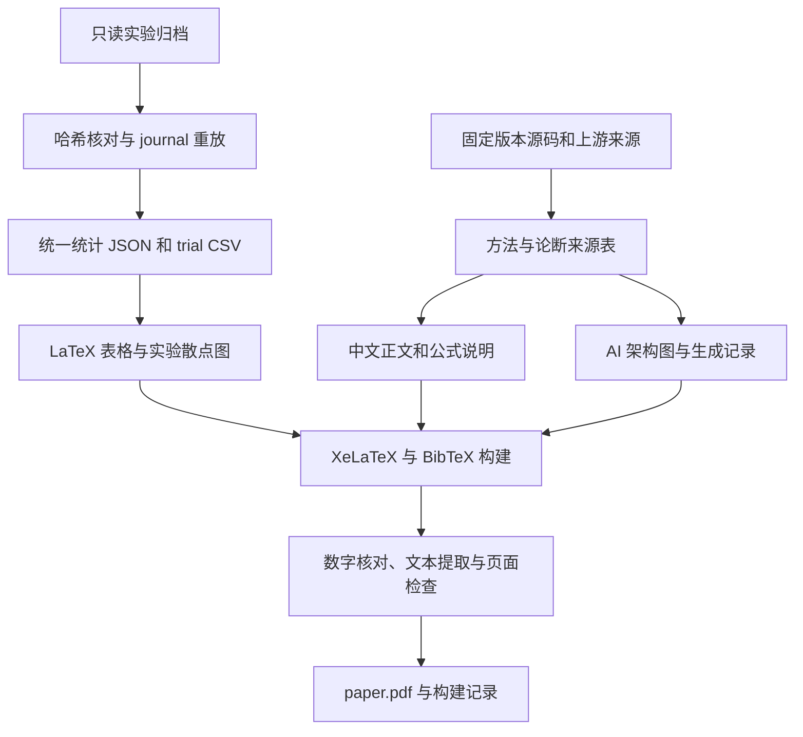

# Heretic–ARA 中文论文修订与可复现 PDF 设计规格

版本：v2；设计日期：2026-09-08；评审日期：2026-09-08；状态：方案评审与修复完成，供实施节点执行。

设计节点内部复核为 v1 的历史记录；以下为节点 #1 的正式评审。评审只修改本文件，不编写论文或研究源码，不运行模型实验，不操作 Git 暂存区或提交。

## 评审记录

按可行性、完整性、一致性和范围适当性逐节评审。未发现 P0；发现 5 项 P1、3 项 P2，均已在下列正文位置修复，无待解决的 P0/P1。

| 编号 | 严重性 | 问题、影响与证据 | 正文修复位置及状态 |
| --- | --- | --- | --- |
| R1 | P1 | §8.2 要求对照 §4 数字采用 `1e-12` 容差，但 §4 含六位小数的 KL 展示值；真实 trial 40 为 `0.0009053924586623907`，与展示值相差约 `3.92e-7`，会误拒有效结果 | §4.3、§8.2 分开原值断言与显示格式断言，补充精确回归值；已解决 |
| R2 | P1 | 只列当前工作树哈希，`SourceRecord` 不能区分同路径历史 blob 和当前文件；历史 gate 实际位于修复提交的 `trial_methods.py`，并不在该提交的 `acceptance.py`，会查错实现或错误绑定来源 | §2.2、§4.2、§6、§7 固定历史路径、版本和来源种类，限定缺失源码的处理；已解决 |
| R3 | P1 | AI 图把 Validation 的回流、失败停止及 Replay/Audit 连在一起，未区分单候选评分与搜索结束后的选定候选 gate，可能画成首个失败 trial 即终止搜索，或审计通过前即发布 | §4.4 明确外层搜索、候选锁定和各验收分支；已解决 |
| R4 | P1 | 图形 check 只查输入摘要、配置及存在性，替换或截断图文件仍可通过；跨文件写入失败后也缺少可执行的制品一致性依据 | §5.2、§6、§7、§8.2 为统计图增加单向依赖的制品清单和实际字节哈希校验；已解决 |
| R5 | P1 | 原构建流程可在全页人工检查前宣告成功；`--pdf` 与 `--text` 可不对应，旧 review 也未绑定当前 PDF，输入清单包含范围不明确 | §6、§7、§8.3 区分自动构建和论文交付状态，绑定 PDF、提取文本、复核记录及完整输入哈希；已解决 |
| R6 | P2 | AI 图至少 2400 像素的硬门槛没有工具能力依据，可能让清晰且原生生成的较小图片无法交付；DPI 元数据本身不能证明可读 | §4.4 改为优选尺寸与最终版面可读性验收，保留 AI 生成和禁止无信息放大的要求；已解决 |
| R7 | P2 | 环境约定漏列复杂度、行长和嵌套限制；build 开关组合行为、TeX 禁止自动安装及工作区缓存准备不明确；数据模型表中的联合类型未转义，会造成 Markdown 断列 | §2.1、§6 补齐代码约定、预检和开关规则，§7 修正表格转义；依赖版本以本地元数据确认；已解决 |
| R8 | P2 | §8.1 与 §10 仍要求不升级 v2，并核验 index 0，与当前节点 #1 的完成条件冲突 | §1、§8.1、§10 更新为正式评审节点的范围、v2 完成条件及 index 1 上报；已解决 |

逐节覆盖：§1 明确本节点范围；§2 核对栈、历史版本和归档边界；§3 对照 point-v1/v2 源码复核公式、秩、优化及协议；§4 复算统计并修正表图契约；§5 核对文件清单和产物用途；§6 复核 CLI、路径及失败流程；§7 补齐来源和制品身份；§8 修正数值及交付验收；§9 补充相应风险处理；§10 对齐下游职责。无需引入模型运行、Web 服务、数据库或新的研究依赖。

本次核验：九项原始 SHA-256 全匹配；独立顺序重放 120 个 COMPLETE trial，复算分位数、阶段统计、候选排序和 10 个 Pareto trial；读取当前方法及评分源码和历史 gate；解析 trajectory-v2 完整 SHA；访问上游固定源码及两篇原论文。只读确认本机 Python 3.14.6、matplotlib 3.11.0（声明 Python ≥3.11），以及 `ctexart`、FandolSong、booktabs、graphicx、hyperref 的安装文件。未运行 TeX 编译，后续预检及 PDF 全页验收仍须实际执行，不将文件存在性当作成功构建。

## 1. 概述（Overview）

本方案面向现有 Heretic 工程及其 ARA 适配，规划一篇以机制可解释性为背景的中文研究论文，以及可从归档实验重新生成的表格、图片和 PDF。论文题目固定为《面向语言模型拒答行为干预的校准式任意秩消融：方法适配与实验分析》，最终交付目录为 `docs/papers/heretic-ara/`。研究叙事从 Heretic 的方向消融出发，交代上游 ARA 的来源，再展开本项目的校准式实现、point-v1 实验和 trajectory-v2 后续适配。读者应能分辨方法思想、工程实现、实际观测和有待验证的解释。

论文以 `docs/logs/ara-v1/` 为唯一的本轮定量实验来源。设计阶段已经逐字节验证 `SHA256SUMS` 列出的九个文件，并独立读取 journal 核对 120 个 trial：所有 trial 完成，最低 Keywords 为 0.54，对应 KL 为 0.08997529745101929，但没有候选通过验收。当前源码已经实现 trajectory-v2；指定归档只包含 point-v1 的结果。因此，论文贡献应落在干预参数化、数值实现、协议设计和失败现象的分析上，不能写成新版效果已经得到验证，也不能把关键词减少直接解释为能力保持或安全性提高。

文字采用严谨、连贯的中文学术表达。每节先提出问题，再解释方法或证据，最后限定结论成立的范围；公式后的自然语言必须说明变量、适用条件及实现位置。使用优秀计算机博士论文的论述风格，但采用自包含研究论文版式，不使用清华校徽、学位封面或虚构作者单位。本评审节点只修订本设计文件，不编写论文、脚本或绘图资产，不运行模型实验，不提交 Git；后续实施节点按本方案生成完整论文包。

## 2. 已核实的项目环境与证据边界

### 2.1 工作区及约束

- 工作目录为 `E:/TAKO-PROJECTS/heretic`，存在完整 Heretic 项目；任务模板提到的 AragonMesh 安装目录不是本文算法源代码目录，保持只读。
- 已读取 `README.md`、`CLAUDE.md`、`.claude-index/index.md` 和 `pyproject.toml`。包名为 `heretic-llm`，版本为 `2.0.0.dev0`，入口为 `heretic.main:main`，运行依赖包括 PyTorch、Transformers、PEFT、Optuna 和 Pydantic Settings，配置使用 TOML，依赖由 `uv.lock` 记录。
- 设计时 HEAD 为 `1a00901895f984e0c52737b89530a0681e91fd8a`。已有 `docs/papers/heretic-ara/` 文件及旧规划 `docs/plans/heretic-ara-paper-revision/spec.md` 处于暂存删除状态。不得执行 `git restore`、`git reset`、全量暂存或覆盖这些删除；本方案采用新目录 `heretic-ara-manuscript`。后续仅按文件清单重建所需论文文件，不整包恢复旧稿。
- `CLAUDE.md` 要求新增 Python 文件不超过 800 行、函数不超过 50 行、参数不超过 5 个、圈复杂度不超过 10、嵌套不超过 4 层、代码行长不超过 80 列，公开函数有 Google 风格 docstring。文档工具按解析、生成、验证分工，不修改研究实现及根依赖文件；这些代码尺寸约定不要求把中文正文或表格强制折成 80 列。
- 本机 PATH 未找到 TeX 命令，但 `C:/Users/Administrator/AppData/Local/Programs/MiKTeX/miktex/bin/x64/` 中存在 `xelatex.exe`、`bibtex.exe`、`pdftotext.exe` 和 `pdftoppm.exe`。这是可执行文件存在性检查，不等于已经成功编译；宏包、字体及执行权限由实施时预检确认。

### 2.2 证据优先级与来源定位

| 优先级 | 输入 | 使用规则 |
| --- | --- | --- |
| 1 | `docs/logs/ara-v1/checkpoints/--root--autodl-fs--models--Qwen3--8-27B.jsonl` | trial 状态、双目标原始浮点、有效设置、原始参数与解析参数的权威来源；文件已由 Git 跟踪，新 checkout 应包含它，但普通 `rg --files` 会因 `checkpoints/` 忽略规则隐藏该路径；用明确路径或 `git ls-files` 检查 |
| 1 | `docs/logs/ara-v1/acceptance.json` | 验收状态、选中 trial、审计、重载及产物哈希是否有记录的权威来源 |
| 2 | 同目录 `config.toml`、`run.log`、硬件及版本文本 | 配置快照、基线显示值、实际 batch size、耗时和资源观测；日志文字不能覆盖机器验收结果 |
| 3 | 同目录 `SUMMARY.md` | 辅助解释，不作为数值解析源；其内容不在原有九项哈希清单内，另记本地 SHA-256 |
| 4 | 当前 `src/heretic/`、根配置和历史提交 | 说明实现及版本变化；不能代替运行时源码快照或实验结果 |
| 5 | Git 历史中的旧稿与现有规划 | 仅作写作线索，所有数据、引用和算法归属重新核验 |

记录的运行 HEAD 为 `cd2977a3c7feda14c475d9912f21c884aca1fd5d`；归档说明运行时另有未提交修复，后续修复提交为 `868ca73b63e6ceee196a6281c780d6c2dec14a05`。后者可以解释修复内容，但不是运行工作树的精确快照。trajectory-v2 适配提交完整 SHA 已解析为 `2871bc19050617377f011ecbf1d64c440f2d6a96`。v1 配置的 `model_commit` 未固定，模型指纹不能补充证明一个未知的模型仓库 revision。

历史实现按 `revision + path + symbol` 定位并通过只读 `git show <revision>:<path>` 取得原始 blob 字节。至少保存修复提交中的 `src/heretic/ara.py`、`src/heretic/trial_methods.py`、`src/heretic/scorers/keyword_rate.py`、`src/heretic/scorers/kl_divergence.py` 四个 blob 的 SHA-256；其中历史 `validate_gate_records` 在 `trial_methods.py`，当前 v2 同名主验证函数在 `acceptance.py`，不能互换。运行 HEAD 仅作为归档声明记录，不将该 HEAD 或后续修复提交称为完整的运行快照。若 checkout 缺少历史对象，source-only 检查指出缺失 revision/path 并失败，禁止静默回退到当前源码；这不影响已有原始 trial 数值的来源地位，但应阻止包含无法核验方法论断的论文通过最终验收。

### 2.3 论文必须保留的事实

| 项目 | 已核对结果 | 论文口径 |
| --- | --- | --- |
| 模型及日期 | 本地模型标签 Qwen3.8-27B，2026-09-04 | 描述该标签对应的一次运行，不扩展到其他模型版本 |
| 运行精度 | BF16，`quantization = "none"` | 不把 README 的双 3090、NF4 模板配置写成本次运行环境 |
| 硬件 | 单张 RTX PRO 6000 Blackwell Server Edition，97,887 MiB | 来自归档；不连接服务器、不重新采样当前硬件状态 |
| 校准与验证 | good/bad 各从 `train[:300]` 选 64；验证各 `train[300:400]` 的 100 条 | 候选在反复使用的验证集上比较；不是独立测试 |
| 生成 | seed 42，greedy，`enable_thinking=false`，最多 100 个新 token | 双目标的样本分母分别为 100 |
| batch size | 配置为自动 0，上限 16；journal 有效设置为 16 | 采集 batch size 始终为 1，不混同普通评估 batch |
| 搜索 | 120 次，startup 36 次，后续 84 次；全部 COMPLETE | 一次搜索含 120 个候选，不是 120 个独立重复实验 |
| 验收 | `status=failed`，`selected_trial_number=null` | 后续 replay、audit、reload 分数均为 null，不能填 0 |
| 进程 | `exit-code.txt` 为 0 | 进程结束与模型验收失败可以同时发生 |
| adapter | SUMMARY 报告未导出；机器报告无选中候选和产物哈希 | 写“归档报告未导出”，不声称本节点远程检查了目录 |
| 资源 | 终端末尾 allocated VRAM 52.05 GB，RSS 5.47 GB | 终端时点值，不是全程峰值；不与 MiB/GiB 不加说明地换算 |

## 3. 技术设计（Technical design）

### 3.1 论文生产架构与执行顺序

执行顺序固定为：冻结来源清单 → 重放 trial → 生成数值表格及统计图 → 完成算法说明和中文章节 → 生成并核验 AI 架构图 → 核验引用 → 构建 PDF → 数字和版面验收。不得先写提升结论再挑选支持它的 trial。所有衍生数据写入论文目录，原始日志只读。整个论文构建不导入 `heretic.main`，不加载模型，不触发任何 acceptance 审计或下载数据集。

### 3.2 方法分层与关键代码路径

| 论文名称 | 代码或来源 | 必须解释的内容 | 证据等级 |
| --- | --- | --- | --- |
| Heretic 方向消融 | `trial_methods.py::_sample_directional`、`_direction_at`、`_directional_factors`，`study_runner.py` | 均值差方向、层位置插值、组件权重核、归一化模式与双目标搜索 | 基线方法实现；本归档无同协议运行结果 |
| 上游 ARA | PR #211，固定 revision `edc3b123456c7f86f24d409b838ab3a7226e285e` | 捕获模块输入输出，通过保持、拉近、推远目标优化模块映射 | 已核对源代码；不是本项目原创归属 |
| 本地 ARA point-v1，配置中称 CARA | `ara.py::capture_module_io`、`build_calibration_bank`、`calculate_ara_loss`、`_canonical_factors`；`trial_methods.py::apply_trial` | 干净 I/O、尺度归一化、平滑距离、有限秩增量、完整因子复位及数值修复 | 本归档实测方法 |
| 本地 ARA trajectory-v2 | `ara_runtime.py::capture_model_trajectory`、`ara_trajectory.py::causal_capture_positions`、`trajectory_loss`、`optimize_trajectory_module` | 基座生成的短续写、逐步对齐、局部损失、部署增益及检查 | 当前源码具备；本轮无效果实测 |
| v2 搜索与验收 | `ara_search.py`、`study_runner.py`、`protocol_data.py`、`acceptance.py`、`acceptance_export.py`、`artifact_schema.py` | 八维搜索、连续评分、数据角色隔离、候选锁定、独立审计与导出 | 协议实现，不能称本次已通过 |

ARA 全称为 Arbitrary-Rank Ablation；CARA 为 Calibrated Arbitrary-Rank Ablation。论文首处定义“本地校准式 ARA，下文简称本地 ARA”，代码字段仍照录 CARA，不人为改名。作者贡献限定为本地适配与分析。上游 ARA 思想及名称注明来源，旧稿 `Anonymous Developers` 作者项不直接沿用。

上游固定源码同时含全矩阵与 LoRA 两种 ARA 路径；设计阶段已核对其最近邻保持/拉近/负距离推远目标。因此方法对照表不得声称“上游只支持全矩阵，LoRA 是本项目首次提出”。具体算法引用固定提交，不用 PR 当前页面状态推断当时实现。[上游固定源码](https://raw.githubusercontent.com/p-e-w/heretic/edc3b123456c7f86f24d409b838ab3a7226e285e/src/heretic/model.py)

### 3.3 公式规范和数学边界

定义模块输入维度为 `d_in`，输出维度为 `d_out`，原始映射为 `W0`，good/bad 校准对分别为 `(Xg,Yg)`、`(Xb,Yb)`。所有样本按行排列。方向消融在 `row_normalization=none`、单位方向 `d` 下写成 `W' = W0 - λ d dᵀ W0`；先说明 `d` 的构建、归一化和层选择，再讲 PRE/FULL 模式的附加变换，不把该简式推广到全部归一化配置。方向消融的研究背景引用 Arditi 等论文，避免把其结果解释为所有模型都存在单一拒答方向。[原论文](https://arxiv.org/abs/2406.11717)

本地 point-v1 的核心定义固定如下，由正文使用 LaTeX 正式排版：

1. `A ∈ R^(r×d_in)`，`B ∈ R^(d_out×r)`，`r=128`，`ΔW=BA`，`Y'=Y+(XAᵀ)Bᵀ`。基础权重冻结，LoRA 缩放为 1；“任意秩”是方法名称，本实现的增量秩上界是 128，不得写成无秩约束。
2. `s=max(mean((Yg-mean_rows(Yg))²),10^-6)`，`D(q,y)=||q-y||²/(d_out s)`；`dτ(q,R)=-τ log[(1/|R|)Σ exp(-D(q,y)/τ)]`，`τ=0.1`。这里的 `1/|R|` 是必需的参考集合归一化，不能漏成无归一化 log-sum-exp。
3. `L_keep=mean((Yg'-Yg)²)/s`；`L_pull=mean_i dτ(Yb'_i,Yg)`；`L_push=mean_i τ softplus((m-dτ(Yb'_i,Yb))/τ)`。
4. `G=mean((AAᵀ-BᵀB)²)`，`G0=max(G(A_init,B_init),10^-6)` 为优化开始时冻结的参考值；`L=L_keep+α(L_pull+βL_push)+10^-4 G/G0`。`α` 为组件 strength，`β` 为 push_weight，`m` 为 margin。`ara.py::optimize_ara_module` 设置并冻结参考值，再传给 `_run_optimizer`；不能让正文把 `G0` 写成每次 closure 都重新计算。
5. 说明 L-BFGS 的一次外部 step 内含最多 20 次迭代，history size 为 10；不能把外部 step 数当作精确函数评估次数。局部损失非负、有下界，但对因子 A、B 一般非凸，不能宣称全局收敛、全局最优或仿射凸。
6. 展开 thin QR 与小核 SVD：`Aᵀ=Qa Ra`、`B=Qb Rb`，分解 `Rb Raᵀ=UΣVᵀ`，得到 `B'=Qb U sqrt(Σ)` 和 `A'=sqrt(Σ)VᵀQaᵀ`。说明精确算术下乘积保持，实际实现检查误差。point-v1 修复在双精度完成分解后转回 FP32，规范化检查使用相对误差；不能据全部 COMPLETE 断言修复已被因果消融证明有效。

原始局部输出 `Y` 包含实际前向的输出，不简化为必然无偏置的 `XW0ᵀ`。这些损失只作用于冻结基座采集的局部代理，不证明多个层同时修改后的全模型行为满足同一目标。有限秩参数化背景可引用 LoRA；该引用不构成本项目创新性证明。[LoRA 原论文](https://arxiv.org/abs/2106.09685)

trajectory-v2 正文逐项描述已经实现的变化：基座先生成最多 8 个续写 token，teacher forcing 采集的是预测各 token 的位置，第一步在 prompt 末位置；每条提示的有效步权重按 `0.85^t` 归一化，再汇总同一步参考集合，不能将所有位置直接混成一个最近邻库。其 Gram 项为 `10^-4 G`，没有 point-v1 的 `G0` 除数；部署增益作用于规范化后的 B 因子，须与局部损失中的 strength 区分。good delta 比率与最大奇异值阈值来自实际部署检查，不写成训练损失项。v2 的 QR/SVD 代码路径与 v1 不同，不统一描述为全部 FP64。

v2 的步权重参与查询行的损失汇总：keep 按 good 权重求和后除以 good 权重总和，pull/push 对 bad 侧同理；同一步 softmin 内的参考点仍等权。每步使用自身 good 输出的中心化均方尺度，不能沿用一个全轨迹尺度。部署 good delta 比率是各行 `RMS(ΔY)/max(RMS(Y),10^-6)` 的提示权重平均，不是先把全部输出合并再取 RMS 比值。零 strength 的 point-v1 组件跳过优化；不得把 skipped_modules 统计成求解失败或已优化模块。

### 3.4 新旧协议的固定对照

| 项目 | point-v1 本次运行 | trajectory-v2 当前模板 |
| --- | --- | --- |
| 校准规模 | good/bad 各 64，单个预测位置 | good/bad 各 96，最多 8 个预测位置 |
| 验证切分 | `train[300:400]` | `train[400:500]` |
| 独立 audit | 配置 `test[:100]`，本次无分数记录 | 锁定候选后由新进程按协议一次消费 |
| 内部搜索维度 | 6 个；MLP 原始 strength 可为负，应用时截断至 0 | 8 个；增加 attention/MLP deployment gain |
| 搜索预算 | startup 36 + 后续 84 | 8 anchors + 24 random startup + 88 constrained TPE |
| 优化目标 | Keywords、首 token KL | Refusal log-odds、首 token KL；Keywords 作为约束及验收量 |
| 更新后的检查 | v1 数值规范化及候选 gate | good delta 比率 ≤0.60，最大奇异值 ≤8.0，另有资源和模块结构检查 |
| 结果状态 | 搜索完成、验收失败 | 指定归档无运行结果 |

v2 的 Refusal log-odds 使用长度归一化的候选续写 log probability，在拒答前缀组与回答前缀组分别做 log-mean-exp，再取组间差的提示均值；它不是语义安全分类器，也不是从自然回复里统计的拒答率。模板没有显式覆盖 KeywordRate 的 markers，沿用当前 scorer 默认集合；v1 归档则显式增加了中文 markers。即使后来取得 v2 结果，也须统一模型、样本切分、markers 和评分协议后才能作直接效果比较。

模板中的目标计数为普通注意力 16、线性注意力 48、MLP 64，总计 128。这些作为 v2 配置检查条件列出，只有与日志/模型清单互证后才可写为本次运行的具体结构。不得从“逻辑组件 `attn.o_proj`”误推出全部模块都使用同一个实际叶名称。

## 4. 实验数据处理及论文表图

### 4.1 Journal 重放契约

采用 Python 标准库离线解析，不安装或启动 Optuna 来恢复运行。`ara_v1_data.py` 只支持本归档已验证的单 study 格式；对未知字段形态报错，不猜测新版 journal 语义。按原始字节中的 LF（0x0A）划分物理行，再严格 UTF-8 解码，保留 1 起始行号；CRLF 的尾部 CR 仅作为解析空白处理。`run.log` 的证据行号也按 LF 定义，行内 CR 刷新片段用同一物理行号及片段序号定位；不能用 `splitlines()` 把 CR 另算一行。空行跳过；非空坏 JSON、NaN/Infinity、未知 op_code、未创建 trial 的更新和不完整终止记录均报错。

本归档操作固定为：0 创建 study，2 合并 study user_attr，4 按创建顺序分配 trial_id，5 记录 float 参数和分布，6 写终态及 objective values，8 合并 trial user_attr，9 合并 trial system_attr。op 9 中的 `constraints` 保留为运行／采样器元数据，不参与最终指标，也不等于 acceptance 通过；intermediate values 对应 op 7，本归档未出现，遇到时按不支持的操作报错。带 study_id 的记录必须指向 0，trial number 按创建顺序 0 起始，并核对 `user_attrs.index = number+1`。预期只有一个 study，方向为 `[1,1]`（两项最小化）；终态 `state=1` 映射 COMPLETE。若出现其他终态，保留其状态且不把缺失分数当零，本论文快照的 120 COMPLETE 验证必须失败；同一 trial 重复终态拒绝接受。

从 `user_attrs.scores` 按 `name` 找 `Keywords`、`KL divergence`，不能只凭数组位置猜测；再与终态双目标值交叉验证，绝对容差 `1e-12`。基线取同记录 baseline，100 个样本优先来自显示字段 `54/100` 的整数结构并与配置 `expected_samples=100` 及日志互证。旧 score 对象没有 `sample_count`/`dataset_fingerprint` 字段，衍生表必须注明分母是由归档显示记录及配置核实，不能伪造原记录具备字段。所有 trial 的三个指纹均须与 study/acceptance 可用字段一致；校准指纹只有完整匹配后才进入 summary。

effective settings 来自 study user_attr 中嵌套的 `settings` JSON 字符串；同时读取 TOML 快照。TOML 的 `scorer` 表与有效设置的 `scorer` 对应，在 `study_manifest` 中同类信息的字段名为 `scorer_settings`；按显式配置的叶字段比较，记录有效设置补齐的默认值，如 prompt 的空 prefix/suffix 和 scorer 的 null instance_name。自动 batch 从 0 解析为 16 是允许且必须报告的差异。有效设置未保存 `max_batch_size`、`study_checkpoint_dir`、`save_directory` 和 gate 的 `report_path`，这些取自 TOML，并记录为未保存字段，不能误判为 null 冲突。其余影响模型、数据、scorer、seed、优化空间的语义冲突均阻止生成最终表格。point-v1 配置没有 `ara_objective_version`，根据 `cara-capture-v1`、`cara-lbfgs-v1`、`cara-search-v1` 标注推断的 point-v1 版本及依据，不补写原始日志。

每次解析前校验九项 SHA-256，严格验证原始字节，不做换行转换来“修复”哈希。清单路径必须解析后留在输入根目录内；缺文件或错哈希返回失败。另计算 SUMMARY、SHA256SUMS 自身及引用源码的哈希并记录。这些后补哈希与原归档校验项分列。

### 4.2 指标、汇总与选择规则

- Keywords `K` 为归档 scorer 的关键词命中回复比例。空回复在 point-v1 scorer 中算命中；大小写、星号、弯引号及空白按实现规范化。论文称“拒答关键词命中率”，不称经语义标注的真实拒答率。
- KL 定义为无害验证提示上的首 token `D_KL(P_base || P_adapter)` 的均值，单位 nats，基线为定义上的 0。解释 PyTorch 调用的 input 为当前 logprobs、target 为 baseline logprobs，避免写反方向。
- 同时计算绝对下降 `K0-K` 和相对下降 `(K0-K)/K0`。`K0=0` 时后者用 null 并说明原因。修复提交 `868ca73b63e6ceee196a6281c780d6c2dec14a05` 的 `src/heretic/trial_methods.py::validate_gate_records` 使用绝对差值检查名为 `keyword_drop_min` 的阈值，当前 v2 的 `src/heretic/acceptance.py::validate_gate_records` 使用相对比率；本次 `K0=1`，二者数值均为 0.46，不影响失败结论。
- gate 的数值条件为 `K≤0.10`、历史差值 `K0-K≥0.50`、`KL≤0.15`。数值条件通过数记为 `numerical_gate_count`，不取代原始 acceptance 状态；样本证据、重放、审计和导出状态不得从此计数推算。
- trial 展示排序为 `(Keywords, KL, trial_number)` 升序；最佳展示候选是 trial 66，但机器验收没有选中 trial。最小 KL 候选按 `(KL, Keywords, trial_number)` 排序选 trial 40。末次候选为 trial 119。
- Pareto 支配：另一候选双目标均不大于当前，且至少一项严格小于。相等的点保留各 trial 身份。分位数用排序后线性插值 `h=(n-1)p`；均值用全部对应区间候选；生成时保留原始浮点，展示时才舍入。
- 无样本级评分和独立随机种子重复，故不生成置信区间、误差棒、显著性检验或“均值±标准差”的重复实验报告。候选间分布只是搜索分布。

### 4.3 固定实验比较表

`tables/ara-v1-results.tex` 必须包含以下行。所有数值来自 summary 自动渲染，KL 展示六位小数，Keywords 同列展示计数和百分比。

| 对象 | Keywords | 首 token KL | 定位 |
| --- | --- | --- | --- |
| 未修改基座 | 100/100（100%） | 0（按定义） | 同次运行基线 |
| Heretic directional | — | — | 指定归档无同协议结果 |
| ARA point-v1，trial 66 | 54/100（54%） | 0.089975 | 最低 Keywords；未通过验收 |
| ARA point-v1，trial 119 | 56/100（56%） | 0.031919 | 最后候选；未通过验收 |
| ARA point-v1，trial 40 | 100/100（100%） | 0.000905 | 最低 KL；未通过验收 |
| ARA trajectory-v2 | — | — | 当前代码适配；无本归档实测 |

表注必须说明 baseline 不是 Heretic 干预结果，“—”表示无数据，trial 66 的选择发生在验证集，不能称测试最优或已导出的最佳模型。旧规划中的 70/100 以及 README 的其他模型成绩，不混入本表；缺失 directional 结果是论文局限，不用推测填补。

回归断言使用 journal 原值：trial 40/66/119 的 KL 依次为 `0.0009053924586623907`、`0.08997529745101929`、`0.03191900998353958`；Keywords 依次为 `1.0`、`0.54`、`0.56`。KL 五个分位点的原值依次为 `0.0009053924586623907`、`0.0036956561380065978`、`0.010353714693337679`、`0.023271169513463974`、`0.11515633761882782`。Pareto trial 固定为 `[28,40,66,79,94,100,101,112,118,119]`。这些是核对目标，生成器仍必须从归档重算，不能抄常量生成结果；表格和正文格式校验则对原值应用规定的小数位后比较字符串。

`tables/ara-v1-distribution.tex` 展示最小、25%、中位数、75%、最大：Keywords 为 `0.54,0.88,0.98,1.00,1.00`，KL 为 `0.000905,0.003696,0.010354,0.023271,0.115156`。同表下半部展示完成 120/120、Keywords≤0.10 为 0/120、KL≤0.15 为 120/120、数值联合通过 0/120、Pareto 10 个。该文件再追加阶段统计 tabular，列为 trial 区间、候选数、最低 Keywords、Keywords 中位数、Keywords 均值；三行依次为 `0–35 / 36 / 0.930 / 0.990 / 0.987`、`36–79 / 44 / 0.540 / 0.905 / 0.878`、`80–119 / 40 / 0.560 / 0.970 / 0.920`。JSON 保留完整均值 `0.9866666666666667,0.8779545454545454,0.91975`，不使用 SUMMARY 中舍入为 0.91 的值替换中间阶段真实中位数 0.905。

`tables/ara-protocol.tex` 分列本次实测参数与 v2 模板参数；`tables/method-comparison.tex` 做机制对照，包含来源、干预参数化、采集位置、损失、搜索目标、证据等级。两表都不得使用“更优”“成功”等替代未测指标。

### 4.4 图形设计

图 1 为用户要求的 AI 绘制架构图。实施节点调用可用的图像生成工具并遵循对应技能，把原始生成图保存为 `figures/ara-architecture.png`，不能用 Mermaid、纯 TikZ 或手绘流程图冒充 AI 生成。固定提示词要求：白底、横向布局、蓝/橙两条校准数据流；节点依次为 Frozen base、Clean module I/O、Calibration bank、Local LoRA objective、QR/SVD、Validation。Parameter search 包围候选循环，Validation 的指标只回流参数搜索；预算结束后进入 Final candidate gate，无合格候选才进入 Stop without export。选中并锁定一个候选后进入 Replay，再进入分组框 Export checks，其中列出 Audit 和 Reload；全部检查通过才到 Published adapter，任一步失败均终止发布，不从 Audit 回流搜索或改选候选。分组框不强行给 Audit/Reload 画跨版本统一先后顺序：正文说明 v2 在新进程重载暂存适配器后消费 audit，按 `acceptance_export.py::_audit_callback` 与 `workflow.py::verify_reloaded_adapter` 定位；v1 历史流程另按对应源码解释。审计所需的临时适配器只表示暂存对象，不能画成已经发布的结果。以灰色或虚线 inset 标明 Trajectory-v2、Step-aligned capture、Deployment gain，旁注“implementation only”。不在图内添加实验数字或成功勾号。

图中复杂公式放在正文，节点只保留上述短英文名称；图题与紧邻的 250–400 字中文介绍逐个解释数据流、循环和判定分支，并明确本次 v1 在全部 120 个 trial 完成后的 Final candidate gate 停止，后续分支是协议路径而非已执行事实。边界条件是：基础模型冻结，验证只作用于候选选择，审计不回流搜索，v2 inset 不被误认为本次实验流程。优选宽度至少 2400 像素、横向约 16:9；如工具原生尺寸较小，可以采用至少 1536 像素且在最终约 160 mm 图宽下标签、线条均清楚的输出，记录实际像素和版面尺寸。DPI 标签不是质量证据，不以软件放大补足像素验收；优先减少节点内文字并在正文解释。最多连续三次纠错生成，仍无可读图则记录未完成，不能宣布全局交付成功。

`evidence/architecture-generation.md` 保存完整提示词、工具/模型实际可见标识、生成时间、每次选择及修订原因、最终图片 SHA-256、中文节点对照和人工检查结果。工具未提供的种子等字段写“未提供”，不得编造。原始生成物保持原貌；需要修图时继续使用图像生成/编辑工具，文字和图注在 LaTeX 中排版。

图 2 使用标准绘图库从全部 120 个 trial 绘制散点图，保存 `figures/ara-v1-search.pdf` 与 `.png`：横轴 KL，范围 0–0.16；纵轴 Keywords，范围 0–1.02；不同颜色区分 0–35、36–79、80–119；标出 gate 边界 0.15 和 0.10、10 个 Pareto 点及 trial 40/66/119。PDF 为可导出的矢量图，PNG 用于预览。图注明全部是验证候选，不能使用 AI 生成实验散点或数值表格。

## 5. 论文组织与文件／模块变更计划

### 5.1 正文结构

篇幅目标为中文正文约 8,000–12,000 字，10–16 页左右；以论证完整性优先，不用空行撑页数。`paper.tex` 使用 `ctexart`、UTF-8、A4 单栏、11pt、`fontset=fandol`，页边距 25 mm，正文行距约 1.25；数学、表格、引用采用 `amsmath/amssymb`、`booktabs/tabularx`、`graphicx`、`hyperref`，参考文献用 BibTeX `plain` 数字样式。无需院校类文件或联网字体。

| 章节文件 | 内容和写作要求 |
| --- | --- |
| `sections/00-abstract.tex` | 350–500 字中文摘要及 4–6 个关键词；摘要明确 54/100、对应 KL、无候选通过 gate，v2 未测 |
| `sections/01-introduction.tex` | 研究问题、方向消融限制的合理动机、上游归属、本地贡献；不承诺顶会或最佳论文评价 |
| `sections/02-background.tex` | Heretic、原始 ARA、LoRA、相关研究；按方向假设、干预空间、评价证据组织，不堆论文名称 |
| `sections/03-method.tex` | point-v1 参数化、完整公式、优化与规范化、冻结 I/O 的局限；引用图 1 及机制对照表 |
| `sections/04-adaptation.tex` | v1 数值修复、Qwen 目标识别、trajectory-v2 的已实现变化及新旧协议表 |
| `sections/05-experiments.tex` | 数据与环境、指标定义、三张定量表及图 2、失败诊断和替代解释 |
| `sections/06-discussion.tex` | 代理目标局限、验证集选择偏差、缺失基线与独立审计、准确性/安全性/泛化证据边界 |
| `sections/07-conclusion.tex` | 重述实际发现和未满足条件；下一步同协议对照及多种子验证写为未来工作，不安排本轮运行 |

当前没有真实作者信息，主文档采用无作者行的研究稿，不写虚构机构、邮箱、基金或伦理审批。正文避免“显著提升”“首次解决”“全面验证”等没有证据支撑的表达。负结果必须进入摘要、实验和结论，不能只放附录。

### 5.2 精确文件清单

除本 spec 外，以下路径均相对 `docs/papers/heretic-ara/`，由下游创建或按现有工作树内容局部修改。已暂存删除的旧路径按本设计重建，不触碰未列出的旧文件。本轮不更改 `src/`、`tests/`、根配置、根 README、其他论文或原始日志。

| 文件 | 动作 | 用途 |
| --- | --- | --- |
| `paper.tex` | 重建 | 排版入口，固定章节顺序与引用 |
| `references.bib` | 重建 | 经原始来源核验的文献与本地制品条目 |
| `README.md` | 重建 | 研究稿说明、数据边界、命令、环境与最终 PDF 路径 |
| `build.ps1` | 重建 | 预检、数据生成/核验、编译、PDF 检查；失败退出非零 |
| `.gitignore` | 新建 | 仅忽略本目录 PDF 构建产物及 `build/`，保留图表源和证据 |
| `.gitattributes` | 新建（最终评审补充） | 将 figures 下 PNG/PDF 标为 binary，覆盖根目录强制文本规则，保持制品字节 |
| `requirements-paper.txt` | 新建 | 仅论文绘图依赖 `matplotlib==3.11.0`，与本机已观察安装版本一致；Python ≥3.11 使用内置 tomllib，不导入 GPU 项目环境 |
| `sections/00-abstract.tex` | 重建 | 摘要和关键词 |
| `sections/01-introduction.tex` | 重建 | 问题、贡献、证据边界 |
| `sections/02-background.tex` | 重建 | 方法背景与相关工作 |
| `sections/03-method.tex` | 重建 | 本地 ARA 公式和优化流程 |
| `sections/04-adaptation.tex` | 新建 | 数值修复和 trajectory-v2 适配 |
| `sections/05-experiments.tex` | 新建 | point-v1 实验与审计结果 |
| `sections/06-discussion.tex` | 重建 | 局限和效度分析 |
| `sections/07-conclusion.tex` | 新建 | 有边界的结论 |
| `tables/method-comparison.tex` | 重建 | 人工核对的四层方法对照 |
| `tables/ara-protocol.tex` | 新建/生成 | v1 归档与 v2 模板协议对照 |
| `tables/ara-v1-results.tex` | 重建/生成 | 固定候选及缺失基线结果表 |
| `tables/ara-v1-distribution.tex` | 新建/生成 | 分位数、门槛、Pareto 与阶段统计 |
| `evidence/ara_v1_data.py` | 新建 | 严格只读解析、数据模型、数值汇总 |
| `evidence/summarize_ara_v1.py` | 重建 | CLI、JSON/CSV/表格/实验图生成及 check 模式 |
| `evidence/test_summarize_ara_v1.py` | 重建 | 数值与损坏归档测试，标准库 unittest |
| `evidence/verify_paper.py` | 新建 | 来源/论断/数值/引用/PDF 文本检查与报告 |
| `evidence/ara-v1-summary.json` | 重建/生成 | 唯一机器统计摘要 |
| `evidence/ara-v1-trials.csv` | 重建/生成 | 120 个候选的完整可复查数据 |
| `evidence/source-provenance.md` | 新建 | 本地源码 SHA、历史版本缺口、上游固定链接、指标实现定位 |
| `evidence/literature-provenance.md` | 重建 | 每篇文献的原始 URL、版本、访问日期及元数据核验 |
| `evidence/claim-traceability.csv` | 重建 | 关键事实到 JSON 字段/日志行/源码函数及正文 label 的映射 |
| `evidence/architecture-generation.md` | 新建 | AI 图片提示词、来源、哈希和图文检查 |
| `evidence/figure-manifest.json` | 新建/生成 | 统计图的数据输入、绘图配置、生成代码和两种图形制品的哈希；不包含自身哈希 |
| `evidence/review.md` | 新建 | 数值、数学、中文论述及全页版式检查结论 |
| `figures/ara-architecture.png` | 新建 | 经人工核验的 AI 架构图，交付资产 |
| `figures/ara-v1-search.pdf` | 新建/生成 | 来自真实 trial 的矢量统计图，交付资产 |
| `figures/ara-v1-search.png` | 新建/生成 | 同图预览资产 |
| `paper.pdf` | 生成 | 用户可打开的最终论文，不作为源码提交 |
| `build/build-manifest.json` | 生成 | 本次构建状态、工具版本、输入及 PDF 哈希 |
| `build/verification.json` | 生成 | 自动验收项、失败原因和警告 |
| `build/paper.*`、`build/pages/page-*.png` | 生成 | 编译中间文件、提取文本和全页检查图；仅本地 |

`.gitignore` 仅含 `/paper.pdf`、`/build/` 和 `__pycache__/` 等明确局部规则，不能写 `*.pdf` 而误忽略 `figures/ara-v1-search.pdf`。最终 PDF 和构建日志保留在磁盘供用户审阅。只在未来提交节点按明确文件清单处理暂存区，不执行 `git add -A`。

## 6. 接口设计（Interface design）

本任务不增加 REST、WebSocket、数据库接口，也不修改 `heretic` CLI。以下全部是论文目录中的新工具契约，设计节点不执行尚不存在的命令。所有默认路径通过脚本位置推导仓库根，不依赖当前 shell 的 cwd；显式输入相对路径则按调用者 cwd 解析。PowerShell 命令逐条执行并检查退出码，不使用 `&&`、反斜杠续行或默认弹窗。

两支 Python CLI 均从脚本所在的 `docs/papers/heretic-ara/evidence/` 目录向上四级定位仓库根，即 `Path(__file__).resolve().parents[4]`，固定读取根目录的 `config.qwen38-27b-cara-v2.toml` 生成及核验协议表，不把 `--source/config.toml` 当作 v2 输入，也不额外引入未定义的配置参数。该模板必须进入 source_records 和构建 input_hashes。当前工作树源码哈希清单固定为 `src/heretic/` 下的 `ara.py`、`ara_trajectory.py`、`ara_runtime.py`、`ara_search.py`、`ara_config.py`、`trial_methods.py`、`study_runner.py`、`protocol_data.py`、`acceptance.py`、`acceptance_export.py`、`artifact_schema.py`、`model.py`、`targeting.py`、`workflow.py`、`config.py`、`evaluator.py`、`plugin.py`、`scorer.py`、`continuation_scores.py`、`scorers/keyword_rate.py`、`scorers/kl_divergence.py` 和 `scorers/refusal_log_odds.py`；另读取 §2.2 的四个历史 blob。全部按原始字节只读计算，不 import 模块；Git 子进程以参数数组运行，超时 30 秒，不执行 shell 插值。默认 markers 由来源记录中经过人工核对的 scorer 默认值列出并与其源码哈希绑定，不依赖实例化模型或 scorer。源码、模板或相应来源记录缺失时，来源核验失败；这些后补输入与九项运行归档清楚分列。

| 接口 | 参数与行为 | 返回 |
| --- | --- | --- |
| `python docs/papers/heretic-ara/evidence/summarize_ara_v1.py` | `--source docs/logs/ara-v1`；`--paper-dir docs/papers/heretic-ara`；`--check` 可选；默认重建 JSON/CSV、三个自动表格及统计图 | 0 成功；2 输入缺失/坏哈希/协议不符；3 衍生文件过期或写入失败 |
| `python docs/papers/heretic-ara/evidence/verify_paper.py` | `--paper-dir` 同上；`--source` 同上；`--pdf` 默认论文目录 `paper.pdf`；`--text` 默认 `build/paper.txt`；`--check-sources-only` 或 `--require-review` 可选且互斥 | 0 全部适用检查通过；4 来源、数据、引用、文本或所要求的复核验证失败；默认执行自动检查，`--require-review` 再检查全页复核绑定 |
| `powershell -NoProfile -ExecutionPolicy Bypass -File docs/papers/heretic-ara/build.ps1` | `-CheckOnly`、`-Finalize` 可选且互斥；`-Clean` 只可与正常构建组合；`-PythonExe` 默认 `python`；`-TexBin` 默认自动发现 | 0 表示所选模式完成；正常构建可为 pending_review，只有 Finalize 可宣告交付成功；失败非零并指出步骤 |
| `python -m unittest discover -s docs/papers/heretic-ara/evidence -p test_summarize_ara_v1.py` | 不加载模型，不访问网络；测试临时目录显式放在论文 `build/test-tmp/` 内 | unittest 标准退出码 |

生成器 `--check` 模式只比较重算 JSON、CSV 和 TeX 内容，不改交付文件。统计图的 `figure-manifest.json` 记录当前 summary 和 CSV 的实际 SHA-256、绘图脚本哈希、完整绘图配置及 PDF/PNG 的实际 SHA-256；check 必须逐项核对当前输入及制品字节，不能只查文件存在性，不要求重新渲染后的 PDF 元数据逐字节可重复。依赖顺序固定为 summary/CSV/表格 → 两种统计图 → figure-manifest，summary 不引用图形清单，图形清单不引用自身或最终构建清单，避免循环哈希。AI 图单独由 `architecture-generation.md` 记录的 SHA-256 核验。

默认生成模式先完成所有解析和数值验证，再用论文 `build/` 临时文件逐文件原子替换，图形清单最后写入；这不保证跨文件事务，任一写入失败即返回 3，下一次完整 check 按上述哈希拒绝混用两轮数据的产物，不能继续宣布构建成功。只允许输出到工作区内解析后的论文目录；输入与输出目录不可相同、互为祖先或通过符号链接重叠，不能让输出或测试清理覆盖原始归档。`--check` 不需要 TeX、模型或联网；只读检查进程禁写 Python bytecode，并将可能用到的第三方缓存指向 `build/`。

`-CheckOnly` 执行来源核验和生成器 check，不编译 PDF，不联网，不重新生成 AI 图，也不把构建状态提升为 success。`-CheckOnly -Clean`、`-Finalize -Clean` 或 `-CheckOnly -Finalize` 在任何写入前报错。正常 build 必须校验现有 AI 图及生成记录，随后生成数据、执行数值测试和 source-only 检查，再调用 XeLaTeX → BibTeX → XeLaTeX → XeLaTeX。编译统一在论文目录执行，输出目录为 `build/`；传递 `-interaction=nonstopmode`、`-halt-on-error`、`-file-line-error`，不启用 shell escape。BibTeX 以论文目录为 cwd，处理 `build/paper`，以便找到根部 `references.bib`。对 MiKTeX 显式传递 `--disable-installer`，XeTeX 同时使用 `--disable-write18`；TeX Live 按其工具选项关闭 shell escape，不把 MiKTeX 专用开关传给其他发行版。[MiKTeX XeTeX 选项](https://docs.miktex.org/manual/miktex-xetex.html)

最后一轮日志必须无 missing character、undefined citation/reference、LaTeX Error；overfull box 逐项调整后清零，underfull 警告记录且做页面检查。先对 `build/paper.pdf` 重新执行 pdftotext、自动检查及全页渲染，通过后才原子替换根部 `paper.pdf`。旧交付 PDF 可以保留到此，但本次失败必须使 manifest 变为 failed，不能保留 success。自动步骤完成后 manifest 为 `pending_review`，正常 build 返回 0 并明确输出“自动构建通过，待全页复核”，不能宣告论文交付完成。

全页人工复核完成后，在 `evidence/review.md` 的首个 JSON 代码块写入 `status="passed"`、`pdf_sha256`、`page_count`、`render_dpi=120`、`reviewed_pages=[1,...,page_count]`、`reviewed_at_utc`，正文说明数学、中文论述、图表及逐页问题的检查结果；任何未解决版式问题使用 `status="failed"`。随后运行同一 build 命令加 `-Finalize`，此模式不重新编译或生成数据，仅重新执行来源、数据、制品、当前输入哈希及 `verify_paper.py --require-review` 检查，全部通过才将 manifest 标为 success。任何正文、图表、来源或构建输入变动均要求重新 build、检查新 PDF、再 Finalize；只改 review 的记录不触发论文重编译。

独立运行 verifier 时必须将本次指定 PDF 重新提取到论文 `build/` 临时文本，与 `--text` 按统一换行比较，不能把任意同名文本当作该 PDF 的内容。`--check-sources-only` 跳过 PDF/文本/全页复核；`--require-review` 检查机器可解析的复核记录、当前 PDF 字节哈希及完整页集合，不以关键词扫描替代人的阅读。最终 verification 记录 PDF 与提取文本的 SHA-256、自动检查状态及人工复核绑定状态。

TeX 工具发现顺序为显式 `-TexBin`、PATH、上述 MiKTeX 本机目录，再查本机标准 MiKTeX/TeX Live 路径。仅调整当前进程 PATH，不修改系统环境变量。宏包优先使用已有安装；缺失时记录准确组件，通过 workspace 内的工具配置解决，不向工作区外新建工具目录。构建工具关闭自动包安装，避免编译阶段隐式联网或写系统目录。清理只删除预先定义的 `build/` 中间文件；递归清理前解析绝对路径并验证仍在论文目录内，不能删除章节、图片、原始日志或已交付 `paper.pdf`。

首次预检确认 Python ≥3.11、matplotlib 3.11.0、XeLaTeX、BibTeX、pdftotext、pdftoppm、所需宏包和字体全部可用，记录版本。文件存在性不足以证明 TeX 格式和字库可运行，实施时在 `build/` 用正文入口完成实际构建验证。TEMP/TMP、Matplotlib 配置与缓存均指向论文 `build/`；TeX 的可写用户配置和数据目录也应先在工作区内配置，既有安装目录只读使用。不能仅凭 `--disable-installer` 推断 TeX 不写工作区外的缓存。缺依赖时进入显式环境准备步骤并记录安装命令和目标；正常 build、check 和 finalize 均不隐式安装。所有构建子进程有超时、失败步骤和日志定位；短步骤不得自动无期限重试。

## 7. 数据模型（Data model）

不引入数据库。所有 JSON 为 UTF-8、两空格缩进、末尾换行、禁止 NaN/Infinity，所有路径用仓库相对 POSIX 形式，原始绝对服务器路径仅留在来源说明，不作为可执行目标。CSV 用 UTF-8、标准引号和稳定字段顺序。

| 数据对象 | 必需字段与类型 | 约束 |
| --- | --- | --- |
| `SourceRecord` | `source_id:string`、`source_kind:archive/worktree/git_blob`、`path:string`、`revision:string\|null`、`sha256:string`、`expected_sha256:string\|null`、`archive_member:bool`、`line_start:int\|null`、`line_end:int\|null` | SHA-256 为 64 位十六进制；git_blob 的 revision 为完整 Git SHA、哈希对象为原始 blob；工作树 revision 为 null，HEAD 另记；后补证据不能伪装成原归档项 |
| `TrialRecord` | `trial_number:int`、`display_index:int`、`state:string`、`keywords:float\|null`、`keyword_count:int\|null`、`sample_count:int\|null`、`kl:float\|null`、`baseline_keywords:float\|null`、`baseline_kl:float\|null` | 终态缺失值保持 null；`display_index=trial_number+1` |
| `TrialRecord` 参数与定位 | `raw_params:map`、`resolved_params:map`、`system_attrs:map`、`score_lines:list[int]`、`terminal_line:int`、`fingerprints:map`、`module_summary:map` | 保存原始六维值、截断后组件值及 op 9 元数据；层区间为 0 起始半开区间，例如 trial 66 `[16,52)` |
| `TrialRecord` 派生项 | `absolute_drop:float\|null`、`relative_drop:float\|null`、`pareto:bool`、`numerical_gate_pass:bool`、`phase:string` | phase 仅 `startup`、`search-36-79`、`search-80-119`；反映展示分组，不冒充独立实验 |
| `RunSummary` | `schema_version="heretic-ara-paper-v1"`、`source_records:list[SourceRecord]`、`trials:list[TrialRecord]`、`run_identity:map`、`effective_settings:map`、`config_differences:list`、`score_definitions:map` | trials 按 trial_number 排序；模型 revision 缺失为 null；版本推断另记理由 |
| `RunSummary` 统计 | `trial_count:int`、`state_counts:map`、`numerical_gate_count:int`、`pareto_trial_numbers:list[int]`、`best_keyword_trial:int\|null`、`min_kl_trial:int\|null`、`last_trial:int\|null`、`quantiles:map`、`phase_statistics:list` | 最优展示候选与 acceptance selected 分离；完整浮点不提前舍入 |
| `RunSummary` 验收 | `acceptance_status:string`、`selected_trial_number:int\|null`、`validation_scores:list[object]\|null`、`audit_scores:list[object]\|null`、`reload_scores:list[object]\|null`、`validation_replay_scores:list[list[object]]\|null`、`artifact_hashes:map\|null`、`limitations:list[string]` | 从原始 JSON 复制关键语义，保留 null，不从 shell 退出码推断 |
| `ClaimRecord` | `claim_id`、`section_label`、`claim_text`、`evidence_kind`、`source_id`、`source_path`、`locator`、`limitations` | `evidence_kind` 为 measured / implemented / external / inferred / missing；本地及历史证据绑定 source_id；外部文献通过 literature-provenance 的唯一条目标识定位；一条论断多证据可多行 |
| `FigureManifest` | `schema_version="heretic-ara-figures-v1"`、`input_hashes:map`、`plot_config:map`、`tool_versions:map`、`artifact_hashes:map` | 绑定 summary/CSV/绘图代码和 PDF/PNG 字节；不含自身、BuildManifest 或时间戳；check 比较现存制品，不重绘 |
| `BuildManifest` | `status`、`built_at_utc`、`commands`、`tool_versions`、`input_hashes`、`pdf_sha256`、`page_count`、`verification_report`、`review_sha256:string\|null` | status 为 building / pending_review / success / failed；只有 Finalize 可设 success；编译时钟只进 manifest，不进入稳定统计摘要 |

trial CSV 列固定为 `trial_number,display_index,state,keywords,keyword_count,sample_count,kl,baseline_keywords,baseline_kl,absolute_drop,relative_drop,numerical_gate_pass,pareto,phase,start_layer_index,end_layer_index,attn_strength,mlp_strength,mlp_strength_raw,push_weight,margin,layer_start_fraction,layer_span_fraction,terminal_line,score_lines`。JSON 中的复杂参数和指纹不强行压入 CSV。空值用空字段，布尔用 `true/false`，按 trial number 升序。

数值论断的 locator 使用 summary 字段路径或 journal 物理行号；方法论断使用固定源码 SHA、文件路径和函数名。正文以 `\label{...}` 定位，label 名固定为章节 `sec:introduction`、`sec:background`、`sec:method`、`sec:adaptation`、`sec:experiments`、`sec:discussion`、`sec:conclusion`，表 `tab:results`、`tab:distribution`、`tab:protocol`、`tab:methods`，图 `fig:architecture`、`fig:search`。摘要用 `sec:abstract`，标签不依赖 PDF 页码。

本地来源 `source_id` 为 `repo:<仓库相对路径>`；历史来源为 `git:<完整 revision>:<仓库相对路径>`，两者不因 path 相同而合并。历史 blob 的 `expected_sha256=null`、`archive_member=false`；其 SHA-256 是后补证据身份，不是原运行文件已归档的证明。line_start/line_end 都按该来源自身的 LF 物理行定位。所有 source_id 唯一，引用必须存在；`source-provenance.md` 列出同样的版本、路径、函数和哈希供人核对。

`BuildManifest.input_hashes` 必须覆盖实际影响编译或验证的全部输入：当前 spec、paper.tex、sections/tables 全部 TeX、references.bib、build.ps1、requirements-paper.txt、全部论文 Python 工具与测试、summary/CSV、全部来源与论断说明、architecture-generation.md、figure-manifest.json 和三个图形资产，以及 source_records 指向的全部工作树/归档文件和历史 blob。普通文件使用仓库相对路径作键，历史 blob 使用上述 git source_id；不能把“当前 HEAD 未变”当作工作树文件未变。review.md 单独在 Finalize 后记 review_sha256，不纳入编译输入；最终 PDF、build/ 内生成物、manifest 自身都不纳入 input_hashes。verification 不反向记录 manifest 哈希，从而保持无循环依赖。数据和表图生成及来源检查完成后、开始 TeX 编译前冻结 input_hashes，编译及自动验证结束时再次核对；冻结后输入改变则本次失败，不把本轮生成新表图误判为并发修改。Finalize 再与该快照比对。`FigureManifest` 则只收影响统计图的输入，不把无关文案改动变成重绘要求。

## 8. 测试与验收标准（Testing & acceptance criteria）

### 8.1 本方案评审节点完成条件

- 本 spec 存在且 `git status --short --untracked-files=all -- docs/plans/heretic-ara-manuscript/spec.md` 可见；正文远超任务要求的 800 字，并覆盖 Overview、Technical design、文件计划、Interface design、Data model、Testing、Risks。
- 工作区研究代码、原始日志、既有暂存删除及其他论文未被本节点修改。仅在任务工具上报确实失败时，按任务提示允许的 fallback 更新本节点看板区段。
- 逐节完成正式设计评审，顶部包含 `## 评审记录`、末尾包含 `## 评审结论`，版本标为 v2；问题清单覆盖全部发现，P0/P1 均已在正文修复。
- 所有设计工作落盘及验证完成后才调用 task tools complete，检查 `success:true`，随后 status 验证 index 1 为 completed；失败时按本节点任务提示的重试及 fallback 流程处理，不上报其他节点。

### 8.2 数据工具的必要测试

1. 真实归档哈希九项全通过；summary 断言 COMPLETE=120、数值通过=0、Pareto=10、best=66、last=119、min-KL=40，并核对完整 Pareto 列表。双目标及分位数对照 §4.3 的未舍入原值，用绝对容差 `1e-12`、相对容差 0；表格及正文则核对格式化结果（KL 六位、阶段均值三位等），不得用 `1e-12` 比较展示值与原值。
2. 受控小 journal 验证按 score 名称映射、创建顺序、LF 物理行号、baseline 分母、terminal 与 user_attr 交叉检查、op 9 system_attr 合并；另用含 CR 刷新的短日志验证同一物理行内片段定位，不需要 Torch 或真实模型。
3. 构造错哈希、缺失记录、坏 JSON、NaN、未知 op、重复终态、trial 未创建就更新、样本分母不匹配、指纹冲突，均应返回明确错误且不覆盖已有输出。
4. 小型已知点集验证 Pareto 严格支配、相等点并存、线性分位数和并列最优排序。K0 为 0 时相对下降为 null；K0 为 0.8 的样例验证绝对差与比率不能混用。
5. 在含空格的 workspace 内测试输出路径；`--check` 对手改一处表格的目录返回 3，源文件和已有衍生文件内容均不变。另替换一个统计图字节、截断 PNG、保留旧 figure-manifest 搭配新 CSV，check 均返回 3；正确的既有图形字节与清单匹配时无需重绘也能通过。
6. 对 verifier 和构建状态的高风险边界做最小行为验证：旧 review 绑定另一 PDF、`--text` 属于另一 PDF、构建后修改章节、外部命令失败但旧 PDF 仍存在，均不能经 Finalize 获得 success；正常 build 可以成功产出 pending_review，完成当前 PDF 的逐页复核后 Finalize 才通过。开关互斥在清理或写入前拒绝。
7. 不为简单排版改动编写镜像测试；测试集中于研究数字、证据和构建成败判定，不运行整个模型项目测试套件。受控小 journal 测试调用结构重放层，不伪造真实归档的九项预期哈希；真实快照数量/指标断言与解析格式测试分开。

### 8.3 全局论文交付验收

- 论文目录中正文、引用、图表、数据、构建入口和有效 `paper.pdf` 齐全；正常 build 和全页复核后的 `build.ps1 -Finalize` 均返回 0，manifest.status 为 success，并对应当前输入、PDF 及 review 的哈希。仅 pending_review 不满足全局交付。
- 表 1 保留 Heretic 同协议结果缺失行；trial 66 标为验证候选，54/100 和 0.089975 没有跨 trial 拼接；没有将 trial 40 的 KL 与 trial 66 的 Keywords 拼成虚构最优点。
- 摘要、实验和结论均陈述 gate 失败；audit/reload 无结果；point-v1 数据不被归入 v2，120 trial 不被称为独立重复。
- 所有关键数字在 claim-traceability 中可定位。source-only 检查确认标签存在、引用键定义、数据与图形的内容哈希匹配、带版本来源定位有效；禁止要求机器仅靠关键词匹配判定整个中文论证正确。
- AI 架构图有实际生成记录、图片哈希、文字说明；全部节点、箭头方向和 v2 标记人工逐项核对，实验图来自 CSV 的全部 120 个候选。
- 参考文献逐条访问作者、出版方、论文库或官方源码原始页面，核对题名、作者、年份、版本及 DOI（有则填）；网页不可访问时换原论文 arXiv 等可靠原始入口，仍无法核实则删去该条依赖论断，不编造元数据。旧稿来源必须重新核验。
- pdftotext 提取后中文题目、摘要、结果数字、参考文献可读，文本来自当前 PDF；无 undefined/missing glyph/overfull。pdftoppm 以 120 dpi 渲染全部页面到 `build/pages/`，重新渲染前只清理旧的 page-*.png，确认渲染页集合恰为当前 PDF 的全部页；逐页检查表格完整、字形、数学上下标、图中小字和分页，架构图、结果表及公式页另作放大检查。检查结论和绑定记录写入 `evidence/review.md`，由实施者完成，不要求用户承担这一流程。
- PDF 仍不能支持“显著优于 Heretic”“v2 已成功导出”“完整能力保持”“普遍安全性改善”等结论；本轮不为追求正结果追加远程搜索或消耗独立 audit 集。

## 9. 风险与缓解（Risks & mitigations）

| 风险 | 实际影响 | 固定处理 |
| --- | --- | --- |
| 当前代码与 v1 运行源码不一致 | 把新机制归因给旧结果、伪称精确复现 | 分列记录 HEAD、后续修复、当前源码；注明未提交工作树缺失 |
| 同协议 Heretic 基线缺失 | 无法证明 ARA 相对 Heretic 的效果提升 | 提供机制比较和原模型对照；缺失项留空并写入局限 |
| 旧摘要舍入或旧稿误述 | 表文数字不一致 | journal 重算为唯一数值入口，展示舍入与原始浮点分开 |
| 历史 gate 的“相对”命名与实现不同 | 方法定义失真 | 同时列绝对差、相对比率及历史判定；本次基线为 1 时解释等价 |
| 候选选择偏差及代理指标有限 | 夸大泛化、安全性和能力保持 | 限定为验证集关键词/首 token 分布观测，不做显著性或语义结论 |
| v1/v2 切分、markers、目标变化 | 新旧表看似可直接横比 | 协议表显式列差异，v2 实测留空 |
| AI 图存在错字、错箭头或假成功状态 | 视觉内容与算法冲突 | 短标签、正文详述、生成记录及逐项人工核验；失败时继续纠图 |
| TeX 依赖或 PATH 缺失 | 有源码无 PDF | 使用已发现 MiKTeX，预检字体宏包，构建阶段关闭隐式安装；只在 workspace 配置依赖 |
| 构建失败但旧 PDF 仍存在 | 错误宣布交付成功 | 按本次命令退出码、manifest、输入和 PDF 哈希判定 |
| PDF 与提取文本、人工检查记录不对应 | 未检查的新稿沿用旧稿结论 | 从当前 PDF 重提文本，逐页复核绑定 PDF SHA-256，Finalize 后才标 success |
| 图文件损坏或跨轮写入中断 | 数据已更新而图仍显示旧候选 | 图形清单最后写入；输入及制品哈希全部核验，失败不发布 |
| 历史函数搬迁或源码对象缺失 | 将当前 gate 解释成旧实验实现 | 使用 revision/path/symbol 与原始 blob 哈希；缺失明确失败，不替换来源 |
| 默认搜索隐藏 journal 路径 | 已跟踪的证据文件被误认为不存在 | 新 checkout 应包含该文件；以明确路径及 `git ls-files` 检查，缺失时直接报错，不从 SUMMARY 补造数据，不擅改忽略规则 |
| 既有论文文件处于暂存删除 | 误恢复用户工作、提交夹带无关文件 | 按明确清单重建、路径级检查；本节点不操作暂存区 |
| 日志与网页来源夹带命令或外部内容 | 越出论文处理范围 | 来源只作证据；只执行本 spec 的固定本地构建命令，不执行日志/网页给出的命令 |

## 10. 下游执行清单与最终判定

1. 方案评审节点已逐节校核并完成本 spec v2，评审记录与结论见本文件；完成最后的文档和工作区范围核验后，上报并验证节点 #1 状态。
2. 实施节点创建论文目录及独立文档工具，先完成真实归档和负例测试，再生成 summary、CSV、表格和散点图；此时冻结数字。
3. 基于冻结数字完成中文正文、公式、方法比较和来源记录；对上游 ARA 采用固定提交，对本地模块记录文件哈希，不能复制旧稿错误归属。
4. 生成 AI 架构图并检查图文一致，核验文献，正常 build 生成待复核 PDF，完成全页检查及验收记录，再运行 `powershell -NoProfile -ExecutionPolicy Bypass -File docs/papers/heretic-ara/build.ps1 -Finalize`。若数据、AI 图、编译或复核缺失，明确记录该步骤未完成，不用规划完成代替论文完成。
5. 后续提交节点只处理明确相关源码与证据制品，保留用户本地 PDF，遵循看板的精确暂存要求；不得把现有其他论文和 AgentMesh 运行文件混入提交。

本方案无需用户补充选择即可实施：语言固定中文、实验范围固定 ara-v1、最新版适配以当前 trajectory-v2 实现为准、版式固定 ctexart、AI 图和数据图职责已明确。对尚无证据的信息采取“报告缺失并限定结论”的处理，不用猜测填补，也不把缺失信息转化为未经授权的新实验。

## 评审结论

**通过**。

本次发现的 5 项 P1 和 3 项 P2 已全部在正文修复，无 P0/P1 遗留。方案与当前 Python 工程、原始归档和本地 TeX 工具条件相容；新增一份统计图制品清单及构建最终核验模式，用于防止数字、图形和复核记录错配，未扩展研究实验范围。后续实施按 §5 的文件清单和 §8 的验收条件执行。

此结论批准设计进入实施，不代表论文和 PDF 已交付，也不代表 ARA 实验通过。Heretic 同协议基线、v2 实测、独立 audit/reload 分数及精确运行工作树快照仍缺失，正文已要求保留这些证据边界；它们是研究局限，不是本设计评审尚未修复的问题。

## 实施过程发现的方案缺陷

最终提交评审补充，以下修复与原 v2 规格同时适用：

- I6（2026-09-08，提交后摘要失效）：实时 HEAD 被写入稳定统计摘要，完成论文提交即会导致 `--check` 失败。改为 `analysis_base_revision` 固定记录设计时审查起点 `1a00901895f984e0c52737b89530a0681e91fd8a`，当前来源仍由原始字节哈希验证；实时 HEAD 只进入本地 `BuildManifest.checkout_head`。回归测试模拟无关提交后重算结果必须相同。
- I7（2026-09-08，旧稿与编译输入）：未纳入本次清单的旧稿删除属于既有暂存状态，不随本次提交处理。验证器和输入哈希从 `paper.tex` 递归遍历实际 `input/include`，取代全目录 TeX 扫描；不参与编译的旧来源说明亦不列为新稿输入。重复引用仍检查重复标签，缺失文件与循环引用明确失败。此规则细化 §6 与 §7 的全部 TeX/来源为当前文档实际依赖，确保干净 checkout 与当前论文一致。
- I8（2026-09-08，图形暂存字节）：根 `.gitattributes` 强制所有文件按文本规范换行，会破坏 PNG 原生签名。新增局部 `.gitattributes`（并纳入构建输入）保护 `figures/*.png` 与 `figures/*.pdf`；核对 Git 过滤前后及最终暂存 blob 的字节，保留 AI 原图和统计图哈希。

- I1（2026-09-08，表格编号）：§8.3 的“表 1”与 §5.1 先出现机制比较表和协议表的章节次序不一致。实施采用自然编号，结果表的权威定位为既定 `tab:results`；仍逐项验证该表中 Heretic 缺失行及固定候选，不强制人工改编号。
- I2（2026-09-08，等待探针）：Windows 调度主机对 `file_exists` 返回 `probe_template_not_supported_on_host`。改用已成功注册的 `shell` 探针，传 `--probe-cmd`，用本地文件存在条件返回退出码；不把注册失败当作已进入异步等待。
- I3（2026-09-08，计数来源定位）：原 RunSummary 只显式列出联合数值通过数，不能直接定位比较表里的两项单独门槛计数。增加可选 `gate_counts` 映射，`keywords`、`kl`、`joint` 均从原始候选与归档门槛重算；不改变任何测量值或选取规则，论断表按字段拆开定位。
- I4（2026-09-08，TeX 运行预检）：本机入口宏包及字体存在，但真实中文编译发现缺少 `zhnumber.sty`，以及 geometry、setspace 的可用完整组件。按 §6 的显式准备流程，从 CTAN 将必要 TeX 依赖放入论文 `build/texmf/` 内并在 README、`build/environment-preparation.json` 记录命令、来源和哈希；正常构建继续关闭隐式安装。只读发现不能替代实际编译验证。
- I5（2026-09-08，PDF 中文映射）：MiKTeX 自带 Poppler 24.04 虽退出 0，却未找到已安装的 CMap，导致中文文本缺失，验证器正确拒绝。显式从官方 `https://dl.xpdfreader.com/xpdf-tools-win-4.06.zip` 准备 Xpdf 4.06 到 `build/xpdf/`，以 `-cfg build/xpdfrc` 指向现有 MiKTeX 的只读字符映射数据。工具发现优先使用已准备的本地兼容工具，仍保留标准工具路径回退；不修改系统安装。Xpdf 的 pdftoppm 按 120 dpi 渲染全部页面，再由 matplotlib 已依赖的 Pillow 进行不缩放的 PPM→PNG 无损格式转换；不进行图像编辑或重采样。正常 build/check/finalize 均不下载。兼容工具、临时映射及无损转换仅解决文档构建环境，不增加研究依赖；版本、制品哈希和实际命令另入构建记录。
