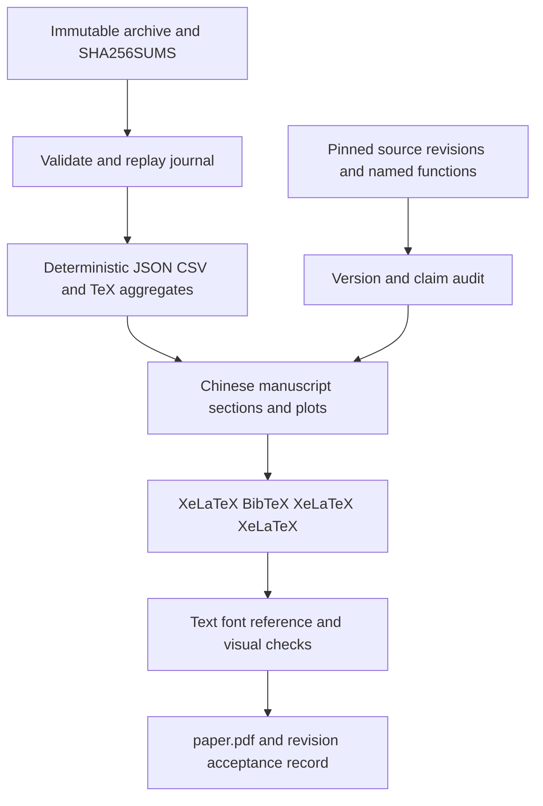

# ARA 论文修订与 PDF 重建方案

Version: v2 · Design review node #1 · Evidence checked: 2026-09-07

## 评审记录

评审范围为方案可行性、完整性、项目一致性及工作量合理性。对照 `CLAUDE.md`、
项目索引、固定版本源码、9 个归档输入、journal、现有论文和构建脚本逐节核验。
以下问题均已在正文修复；无 P0，7 项 P1、2 项 P2，未解决项为 0。

| 编号 | 严重性 | 发现的问题及影响 | 正文修复位置与结果 |
|---|---|---|---|
| R01 | P1 | 归档清单身份、完成标志、参数和模块统计的跨记录校验不完整，可能接受截断或内部不一致的数据 | 技术设计 §5、数据模型、验收 B：固定清单身份和 120 个连续记录，补充配置、分布、解析参数及计数不变量；已修复 |
| R02 | P1 | 未明确机器验收状态必须与重算门槛一致，且把样本分母校验笼统覆盖到没有逐样本记录的 KL | 技术设计 §4–5、数据模型、验收 B：核对失败状态及全部空结果字段，区分 Keywords 分母实证与 KL 配置/日志依据；已修复 |
| R03 | P1 | 只列搜索预算和范围，遗漏具体采样器配置及数值失败约束的语义，影响协议复核 | 技术设计 §4–5、Protocol：补充历史 TPE 设置，明确零约束不代表通过效果门槛；已修复 |
| R04 | P1 | 四个生成文件逐个替换时，写入失败可能留下混合版本；原文没有恢复合同 | 技术设计 §5、接口、验收 B：先暂存全部字节，再逐文件替换；异常退出、清理及重新生成规则明确，构建必须检查整组一致性；已修复 |
| R05 | P1 | 构建报告的生成责任、缺失日志处理、人工验收状态和 PDF 身份绑定不明确，旧检查可能被当作新结果 | 接口、BuildReport、验收 C：预检完整工具链，要求本次日志，限定兼容告警，报告绑定最终 PDF 并逐页验收；已修复 |
| R06 | P1 | 论文源文件及既有溯源资料目前未跟踪，仅暂存修改文件会使后续提交缺少必要输入 | 文件计划、验收 C：允许逐项纳入被引用的既有输入并核验依赖闭包；排除无关文件和构建产物；已修复 |
| R07 | P1 | 概述、验收和上报仍指向节点 #0，并禁止当前正式 v2 评审，存在错报节点的交接风险 | 概述、范围、验收 A、交接：更新为节点 #1 的修改边界及状态核验；下游各按本节点任务执行；已修复 |
| R08 | P2 | 0–35、36–79、80–119 三段容易被误读为三个真实算法阶段 | 技术设计 §4–5：只承认 startup/TPE 两阶段，其余分段标为事后描述窗口；已修复 |
| R09 | P2 | 方法没有说明零强度模块直接跳过，以及目标下降检查实际允许 1e-6 容差 | 技术设计 §3：补充跳过行为、优化前后及规范化后校验范围与容差；已修复 |

逐节结论：概述与范围经 R07 修正后符合当前节点；技术设计 §1–2 的技术栈与
三版本边界可实施，§3 公式与源码相符并补齐 R09，§4–5 按 R01–R04/R08
补强，§6 的中文叙事及证据分级可沿用；文件计划、接口、数据模型、验收、风险
和交接按 R01–R07 收敛。现有 Python 标准库、PowerShell 和 MiKTeX 足以实现，
不需要引入通用 Optuna 重放框架或新实验。保留小型证据解析器及异常输入测试，
因为它们直接保护论文数据；不要求模型重跑或运行完整 Heretic 测试套件。

本次只读复核结果：9/9 原始文件 SHA-256 匹配；120/120 COMPLETE；Keywords
上限通过 0、相对下降通过 0、KL 通过 120、联合通过 0；10 个 Pareto ID 和
全部指定分位数与下文一致。已核对历史采样器、评分器、当前优化器以及
`868ca73` 至 `2871bc1` 的 `ara.py` 零差异。未执行下游论文修改或 PDF 编译。

## Overview（概述）

本方案指导后续节点依据 `docs/logs/ara-v1/` 的真实实验记录及当前实现，修订
`docs/papers/heretic-ara/` 的中文 IEEE 双栏论文并重建 PDF。现稿是针对旧上游
原型的静态源码分析，摘要、引言和结论仍称没有模型级实验；现在可以增加本地
ARA point-v1 的一次失败验收实验，并解释本地方法与旧原型的数学差异。论文定位
调整为“源码形式化、本地适配与失败实验分析”，不能把顶会目标写成已经取得的成果。

已直接校验归档清单中的 9 个文件，全部 SHA-256 一致；从原始 journal 重算得到
120 个完成 trial、0 个通过效果门槛的候选和 10 个 Pareto 点。trial 66 的关键词
率为 0.54，KL 为 0.08997529745101929，基线关键词率为 1.00。验收报告为
`failed`，没有选中候选；审计、重放和复载结果均为空。现有材料只能支持单模型、
单次搜索、验证集代理指标的观察，不能证明通用能力保持、语义安全或机制因果性。

当前节点 #1 只评审和修改本设计文件，已将其升级为 v2；不修改论文、不运行模型、
不编译 PDF、不暂存或提交 Git。只读证据重算属于本次评审。以下技术合同使用
英文明确字段、公式、接口和验收条件；后续论文正文继续使用中文。用户已经要求
直接执行，因此没有确认门槛。实施节点 #2 完成论文及辅助文件变更和 PDF 验收。

## Scope and fixed decisions（范围与固定决策）

The implementation deliverable is a revised, searchable Chinese manuscript and a
freshly compiled `paper.pdf`, accompanied by reproducible aggregate evidence.
Preserve the IEEE conference class, Letter paper, anonymous author placeholders,
existing font choices, and bibliography style. Use this exact visible title and
PDF title: **从多方向到无显式方向：任意秩拒答消融的形式化、适配与失败实验分析**.
There is no newly specified conference page limit. Preserve legibility when the
manuscript grows; do not shrink fonts to preserve the historical nine-page count.

No new model runs, SSH sessions, adapter publication, model-weight changes, scorer
changes, or modifications to `src/`, root configuration, dependency locks, or the
other paper directory belong to this revision. Existing experimental inputs are
immutable. The development server aliases are irrelevant to this local task.
The reference installation under `D:/Tools/AragonMesh/resources/server` remains
read only. All generated files stay inside `E:/TAKO-PROJECTS/heretic`.

This single specification is the node contract; no separate planning documents or
question rounds are required. Node #0 produced v1; node #1 independently reviews
and repairs it here as v2. Only `spec.md` is edited by node #1. Required task-tool
bookkeeping is allowed; direct task-board editing is limited to the prompt's
reporting-failure fallback. Downstream nodes follow their own assigned scope.

## Technical design（技术设计）

### 1. Architecture and evidence precedence

The repository is a Python CLI using PyTorch, Transformers, PEFT, Optuna and
Pydantic settings. The paper has a modular LaTeX entry point, nine section files,
separate tables and TikZ figures, a BibTeX database, and a PowerShell build script.
The revision adds a small offline evidence extractor inside the paper directory.
It must use Python 3.11+ standard-library modules only; local Python is 3.14.6.
Do not import Heretic, load a model, install Optuna, or initialize a writable
Optuna storage merely to read this archived event stream.



Use byte hashes, journal score records, effective settings, and acceptance JSON
as primary local evidence. Use `run.log` for baseline display, capture count,
runtime observations and the misleading shell success message. `SUMMARY.md` is
a useful secondary cross-check, not the source from which to copy every number.
A contradiction must be recorded and resolved against the primary record before
the affected claim is published; never silently change the archive to agree with
the manuscript. The extractor must report a computation error if its inputs are
missing or inconsistent. An experimentally failed acceptance gate is valid data
and must not make successful evidence extraction return an error.

### 2. Three explicit version boundaries

| Manuscript name | Immutable source or observation | Permitted interpretation |
|---|---|---|
| Upstream ARA prototype | `edc3b123456c7f86f24d409b838ab3a7226e285e`, already documented in `evidence/source-provenance-math.md` | Historical full-matrix / LoRA implementation with hard kNN and negative repulsion; no new measurements attributed to this version |
| Local ARA point-v1, also named CARA in code | Run dated 2026-09-04; recorded HEAD `cd2977a3c7feda14c475d9912f21c884aca1fd5d`; deployed uncommitted fixes later represented by `868ca73b63e6ceee196a6281c780d6c2dec14a05` | The only model experiment included in this revision; runtime tree is not completely reconstructible from recorded HEAD alone |
| Local trajectory-v2 | Audited current HEAD `2871bc19050617377f011ecbf1d64c440f2d6a96` and `config.qwen38-27b-cara-v2.toml` | Implemented follow-up protocol and engineering safeguards; no trajectory-v2 effectiveness results are present in the designated v1 archive |

Use full hashes in the evidence files. Visible prose can refer to descriptive
version names and compact identifiers, following the existing separation of
provenance from the paper. Do not imply that the recorded source hash contains
the fixes, or that `868ca73` is a complete snapshot of the exact runtime tree.
The v1 journal records `model_commit: null`; do not backfill the v2 model revision
into the v1 experiment. A model fingerprint is not an independently recoverable
model snapshot. Missing package versions stay explicitly unrecorded.

`src/heretic/ara.py` is byte-equivalent between `868ca73` and the audited HEAD
according to the checked Git diff. Use it for local point-v1 equations, but use
`git show 868ca73:<path>` when explaining historical orchestration and scoring.
Current split modules and v2 changes must not be projected backwards onto the run.

### 3. Method correction and mathematical contract

Keep the old derivation in `sections/03-method.tex`, visibly titled as analysis of
the upstream prototype. Its hard kNN counterexample, full-matrix row normalization,
five L-BFGS step calls, B-only reset, and piecewise outer score are historical
facts, not descriptions of the local experiment. Qualify related statements in
the introduction, comparison, evidence audit, figures, captions and conclusion.

Add `sections/03a-local-adaptation.tex` immediately after that section. Derive
point-v1 from these named functions in `src/heretic/ara.py`:
`build_calibration_bank`, `soft_neighbor_distance`, `calculate_ara_loss`,
`snapshot_adapter_state`, `restore_adapter_state`, `_canonical_factors`,
`_canonicalize`, `_run_optimizer`, and `optimize_ara_module`.

For output width q and paired cached tensors, define

\[
 s_m=\max\{\operatorname{mean}[(Y_g-\operatorname{mean}_{rows}Y_g)^2],10^{-6}\},
 \qquad Z_c=Y_c+(X_c A^\top)B^\top,\quad c\in\{g,b\}.
\]

This cached-output-plus-adapter equation preserves the recorded base response,
including a fixed bias if present. It avoids rebuilding a full effective weight
inside the local loss. It still assumes unchanged cached inputs and is not an
end-to-end guarantee after other modules are edited. LoRA scaling is one under
the targeted configuration, and the update rank is at most 128, not proven 128.

Define the normalized soft neighborhood distance exactly as

\[
 d_{\tau}(z;Y)=-\tau\left[\log\sum_{j=1}^{n}
 \exp\left(-\frac{\max(\|z-y_j\|_2^2/(q s_m),0)}{\tau}\right)-\log n\right].
\]

The implementation computes squared distances with the norm/matmul identity and
clamps roundoff below zero. Retain the `log n` normalization. Then define

\[
 L_{keep}=\operatorname{mean}[(Z_g-Y_g)^{\odot 2}]/s_m,\qquad
 L_{pull}=\operatorname{mean}_i d_{\tau}(Z_{b,i};Y_g),
\]
\[
 L_{push}=\operatorname{mean}_i\tau\operatorname{softplus}
 ((\mu-d_{\tau}(Z_{b,i};Y_b))/\tau),
\]
\[
 G(A,B)=\operatorname{mean}[(AA^\top-B^\top B)^{\odot 2}],\qquad
 L=L_{keep}+a(L_{pull}+\beta L_{push})+
 10^{-4}G(A,B)/\max(G(A_0,B_0),10^{-6}).
\]

Here a is component strength, beta is push weight, mu is margin and tau is 0.10.
The symbol `odot 2` denotes elementwise squaring before averaging all matrix
entries; neither expression is the square of an average or a matrix square.
The Gram denominator is detached and fixed at module optimization entry, not
recomputed with current factors during every closure. The loss is bounded below
by zero in exact arithmetic for nonnegative strengths; it is not bounded above,
and factorization still makes it nonconvex. Soft neighborhoods remove hard top-k
switching from this formula, but no global smoothness or convergence theorem is
claimed, especially across clamping and transactional numerical guards.

State that both A and B reset to the same deterministic initial snapshots for each
trial. State that the local optimizer makes one `optimizer.step(closure)` with
`max_iter=20`, history 10, strong-Wolfe line search, and explicit finite/decrease
checks; closure calls are not the same as internal iterations. Canonicalization
uses reduced QR and a small SVD in float64, restores float32 factors, and checks
the change of adapter outputs on calibration inputs. The checked limits are
relative norm error 1e-5 and relative maximum error 1e-4. Transactional failure
restores the module factors. This is an algebraic/numerical consistency safeguard,
not proof that the fix caused all observed runtime stability.

Apply this optimization description only to modules in the selected layer range
with positive component strength. A zero applied MLP strength skips optimization;
it does not run the Gram-only objective. The decrease guards before and after
canonicalization reject `final > initial + 1e-6`, allowing equality and that
absolute tolerance. Output-equivalence checks use calibration inputs and clamp
their relative-error denominators at 1e-6; do not claim universal equivalence on
unseen inputs from those numerical checks.

The local outer objectives are raw `Keywords` and raw first-token KL, both
minimized. KL direction is base versus edited, as established by the scorer's
`F.kl_div(edited_logprobs, baseline_logprobs, log_target=True)` call, with batchmean
reduction. Define Keywords from the historical `KeywordRate._is_match` method:
empty/whitespace-only responses count as matches; otherwise lowercase, remove
asterisks, normalize typographic apostrophes and whitespace, and check whether
any archived configured marker occurs as a substring. The rate is the matched
response count divided by the prompt count. It is a lexical proxy with possible
false positives and false negatives, not a semantic refusal annotation.
Historical piecewise scores must not label local v1 results.

### 4. Experiment protocol and reference results

| Item | Value and reporting rule |
|---|---|
| Model and hardware | Archived local Qwen3.8-27B path; one RTX PRO 6000 Blackwell Server Edition, 97,887 MiB; driver 595.58.03; Python 3.12.13 |
| Model loading | BF16, no quantization, automatic placement, configured GPU cap 90 GiB; do not describe this run as the earlier dual-3090 NF4 baseline |
| Calibration | Candidate pools are `train[:300]` per class; actual capture is 64+64 prompts; capture batch size 1; rank 128; no row normalization |
| Validation | Harmful and harmless `train[300:400]`, 100 prompts per scorer; repeated throughout all 120 search trials |
| Audit | Configured `test[:100]`; no audit scores recorded because no candidate passed selection; do not infer whether any historical initialization loaded audit data merely from null scores |
| Dataset revisions | Harmful `01cead01398926d81f7c52bdb790ee8cf77ebba7`; harmless `02c6a92cfcf11bb0c387334f8146d149d65b587f` |
| Decoding | Seed 42, no sampling, thinking disabled, maximum response length 100; effective evaluation batch size 16, distinguished from automatic batch-size configuration 0 |
| Search | 120 attempts; 36 startup trials; six sampled coordinates; historical `TPESampler(n_startup_trials=36, n_ei_candidates=128, multivariate=True, seed=42, constraints_func=trial_methods.failure_constraint)`; no v2 eight-anchor schedule |
| Keyword gate | K <= 0.10 and relative drop (K0-K)/K0 >= 0.50; K0=1.00 in this run |
| KL gate | D <= 0.15; all gates are conjunctive on the same candidate |

Record the exact six distributions from journal `op_code=5`, including whether
sampling is logarithmic: start fraction [0.25,0.65], span fraction [0.10,0.55],
attention strength [0.001,1.0] logarithmic, raw MLP strength [-0.10,0.50], push
weight [0,2], margin [0.25,4] logarithmic. Resolve start with floor, span with ceil,
end as the clipped half-open bound, and applied MLP strength as max(0, raw).
Keep sampled and resolved parameters distinct in the evidence output.

Attribute the sampler constructor to `868ca73:src/heretic/main.py` and the layer
resolver and failure constraint to that revision's `src/heretic/trial_methods.py`.
The journal records `system_attr.constraints=[0.0]` for all 120 trials. This is
the absence of a recorded numerical failure, not the keyword/KL acceptance gate;
no claim of acceptance-constrained TPE is justified. Only IDs 0–35 (startup) and
36–119 (adaptive TPE) are protocol stages. Any finer windows are post hoc
descriptive partitions and cannot show an algorithm-stage effect.

| Statistic | Keywords | First-token KL |
|---|---:|---:|
| Minimum | 0.54 | 0.0009053924586623907 |
| Linear 25th percentile | 0.88 | 0.0036956561380065978 |
| Median | 0.98 | 0.010353714693337679 |
| Linear 75th percentile | 1.00 | 0.023271169513463974 |
| Maximum | 1.00 | 0.11515633761882782 |
| Trial 66 | 0.54 | 0.08997529745101929 |
| Trial 119 | 0.56 | 0.03191900998353958 |

Use full precision in JSON and CSV. Display keyword rates with two decimal places
and KL with six decimals in TeX. Trial IDs are zero based; terminal trial 120 is
journal trial 119. Trial 66 resolves to layers [16,52), processes 72 modules, and
has a relative keyword reduction of 0.46, equivalently 46 percentage points
because this particular baseline is 1.00. These two concepts are not generally
interchangeable. Trial 66 is a descriptive minimum-keyword example, never an
accepted or exported model.

Report completion as 120/120 COMPLETE, zero non-COMPLETE trials in this archive,
zero candidates meeting all gates, all 120 below the KL ceiling, and ten Pareto
points with IDs 28, 40, 66, 79, 94, 100, 101, 112, 118, 119. Preserve every trial,
including dominated candidates. Pareto dominance requires weak improvement on
both coordinates and strict improvement on at least one; duplicate coordinates
must not dominate each other. Do not treat these 120 adaptive evaluations as
independent experimental replications or compute an across-seed confidence interval.

`acceptance.json` has `status=failed`, null selected trial, null parameters and
null validation/audit/reload/replay summaries. The first five failure examples in
its reason string are a truncated diagnostic, not a count of failed candidates.
`exit-code.txt` contains 0 and the wrapper printed success, but neither establishes
adapter export. Attribute adapter absence to the archived run report; local
absence alone would not prove remote absence. No remote revalidation is needed.

This revision recomputes aggregates from recorded scalar scores, not model
responses or logits. The archive has no per-prompt outputs or KL arrays from
which to reproduce scoring. Keywords denominators are recorded as counts;
the KL prompt count is supported by effective settings and loading logs, not a
per-trial sample-count field. The frozen run remains a failed experiment, not a
fresh independently reproduced evaluation.

Runtime was reported as 2 hours 38 minutes. GPU allocation around 52.05 GB and
resident memory around 5.47 GB are sampled terminal observations, not measured
whole-run peaks. Preserve original units and labels rather than silently
converting the logger's GB convention or equating allocated and reserved memory.
Do not infer an OOM rate outside this run or a causal improvement over an untested
pre-fix control.

### 5. Offline extraction sequence

1. Resolve the repository and paper roots from the script's own path, so the
   default invocation works from any current directory. Validate every manifest
   entry before writing output. Reject absolute paths, duplicate names and `..`
   traversal; resolve each entry and require it to stay inside the archive root,
   including through symlinks. Reject output roots overlapping the archive, and
   require resolved output destinations to stay inside the chosen paper root.
   Hash raw bytes, not text normalized by Windows newline handling.
   Pin the raw `SHA256SUMS` SHA-256 to
   `1ff138f8be7c4361a828fadc93db071c8357d10e793d8520be669862d58f1a29`.
   Require exactly its nine unique entries, including the designated checkpoint
   path. The pin detects accidental replacement/truncation; it is not an external
   authenticity signature. Overrides may relocate an identical archive inside
   the workspace, not select a different study silently. Never overwrite inputs
   to repair a mismatch; report the path and stop.
2. Read all JSONL events in order. This archived dialect has operations 0 (study
   creation), 2 (study attributes), 4 (trial creation), 5 (parameters), 6 (state and
   values), 8 (trial attributes), and 9 (system attributes). Reject other operation
   codes in this versioned reader. Trial creation has no explicit trial ID here;
   allocate IDs in creation order, starting at zero. Require study 0, one study,
   no references to nonexistent trials, and complete nonempty final records.
3. Merge attribute updates in event order. Parse the nested `settings` JSON,
   `study_manifest`, parameter distributions, score records and resolved
   `ara_parameters`. For this schema terminal state 1 denotes COMPLETE. Reject
   unsupported terminal states or repeated terminal events in the frozen fixture,
   rather than silently including partial data. This reader is archive-specific,
   not a general replacement for Optuna storage.
   Require directions `[1,1]`, final study attribute `finished=true`, and exactly
   trial IDs 0–119, all state 1, with `index=trial_number+1`, `method=ara` and
   `search_space_version=cara-search-v1`. Reject trial mutations after terminal
   events and duplicate parameter definitions. Parse nested JSON without `eval`,
   rejecting duplicate object keys, nonfinite constants and invalid field types.
4. Match scores by `name`, then order them by the configured scorer list before
   comparing against terminal `values`; named-record order itself is immaterial.
   Require finite numbers, keyword rates in [0,1], Keywords baseline 1.0 and KL
   baseline 0. Parse Keywords
   baseline/trial `rich_display` and `md_display` as integer `count/100`, requiring
   their agreement and agreement with the numeric rate within 1e-12. KL display
   strings are rounded values, not count records. Attribute its 100 prompts to
   the configured split and loading log; keep per-trial KL sample evidence null.
   Check model, study and calibration fingerprints across trials and acceptance
   JSON. Missing evidence
   must not be manufactured as a zero.
   Recursively compare overlapping effective settings, study manifest and TOML fields after
   explicit normalization of omitted defaults; permit only the documented
   automatic batch-size change from 0 to 16. Require the six exact FloatDistribution
   names/bounds/log flags, in-range finite samples, and consistent resolved
   component strengths, push weights and margins. Use the logged 64 layers to
   check `start=floor(64*f_start)`, `end=min(64,max(start+1,start+ceil(64*f_span)))`.
   Check nonnegative integer module counts against range/positive strengths,
   with processed+skipped=128 and failed=0 for this archive.
   Validate `acceptance.json` schema `cara-acceptance-v1`, failed status and every
   non-identity result field shown in the archived report as null; match its
   selected trial to the zero conjunctive gate count. Any outcome contradiction
   is extraction failure, never a silent reinterpretation of the report.
5. Calculate quantiles by h=(n-1)p with linear interpolation, minima, medians,
   maxima, stage summaries for IDs 0–35 and 36–119, optional descriptive window
   summaries for IDs 36–79 and 80–119, gate booleans, running
   best keyword rate, and the two-objective Pareto set. No causal correlation,
   significance test or semantic attack success is derived from these aggregates.
6. Validate all data before replacing any destination. Emit deterministic UTF-8
   JSON, CSV and TeX to the exact output paths in the file plan. Use sorted JSON
   keys, `allow_nan=False`, stable ascending trial order, LF endings and no clock
   timestamps. Stage all four complete byte streams to unique temporary siblings
   ending in `.tmp` before replacing any destination. A staging error leaves old
   outputs intact. Replace each file atomically with `os.replace`; this is not
   an atomic four-file transaction. A mid-replacement failure exits 1, names the
   affected path and requires full regeneration before use; remove only temporary
   files created by this invocation. Do not add locks or a transaction service.
   The mandatory `--check` compares all four expected byte streams and refuses
   missing or mixed outputs, so a partial generation cannot enter the build.
   The archive is never opened for writing. Check mode writes nothing and does
   not create output directories. Run only one writer per paper directory.

### 6. Manuscript composition and current-code discussion

Insert the local adaptation section after the historical method, and a new
`05a-ara-v1-results.tex` section after the evidence audit. The result section
contains protocol, distributions, gate outcome, Pareto/trend figure, runtime
observations, and reproduction limits. The conclusion must explicitly acknowledge
that engineering completion coexists with failure of the effectiveness gate.
The abstract must include 120 completed trials, minimum keyword rate 0.54,
associated KL approximately 0.089975, and no accepted adapter.

Append E6 to the existing evidence taxonomy for archived local observations.
Keep E1–E5 meanings unchanged: especially E5 remains proposed future experiments.
Extend `claim-traceability.csv` without changing its seven existing column names.
Qualify source-specific claims within C001–C025 by version and update paper
locations after section insertion; literature claims keep their own publication
scope, and proposed claims remain future work. Add C026–C036 for the local formula, A/B reset, canonicalization,
protocol, 120 completions, best trial, failed acceptance, Pareto statistics,
runtime provenance gap, current v2 controls, and limitations. Mixed code/math
claims can use E1+E2; observed run claims use E6, never E4.

Describe trajectory-v2 in a bounded subsection of the discussion using named
paths: `ara_trajectory.py` for base-continuation capture and same-step losses;
`ara_search.py` and `study_runner.py` for eight coordinates and the 8+24+88
single-worker schedule; `scorers/refusal_log_odds.py` for the continuous score;
`acceptance.py`, `acceptance_export.py`, `artifact_schema.py` and `protocol_data.py`
for selection, replay, audit isolation, fingerprints and staged promotion.
The checked template uses 96 prompts per class, up to eight continuation positions,
decay 0.85 and additional deployment gains. Explain that its Gram regularizer is
not the same normalized term as point-v1. It remains a frozen base-trajectory
proxy. These are source/configuration facts, not observed improvements.

Preserve relevant older nonconvexity and rank arguments, while avoiding claims
that soft neighborhoods inherit the old hard-kNN nonsmoothness counterexample.
State testable hypotheses about activation drift, late-token refusal and search
boundaries as future work. Current changes were motivated by v1 limitations, but
their benefit cannot be established without corresponding experiments.

Do not add new empirical literature numbers in this revision. Preserve existing
citations and their original scope. Add distinct local-source/archive BibTeX
entries with honest repository-artifact descriptions; do not invent a DOI,
publication venue or externally hosted archive URL. If an existing literature
claim requires substantive alteration, verify it against its primary publication
before changing it and record that check in revision provenance.

## File / module change plan（文件与模块变更计划）

In the table, P means `docs/papers/heretic-ara/`. Only the first row is edited
by review node #1. All other changes specify downstream implementation work.
Historical review/debate records are retained as dated history and are not
rewritten to pretend the September 1 reviews examined the revised manuscript.

| File | Action | Exact intent |
|---|---|---|
| `docs/plans/heretic-ara-paper-revision/spec.md` | Review and repair as v2 now | Single implementation contract, review notes, verdict and acceptance checklist |
| P`paper.tex` | Modify | Exact new title and metadata, two new section inputs, pgfplots package with compatibility 1.18 |
| P`sections/00-abstract.tex` | Modify | State local failed experiment and restricted contributions |
| P`sections/01-introduction.tex` | Modify | Introduce three versions and evidence-backed contribution list |
| P`sections/02-background.tex` | Modify | Define ARA versus local CARA terminology without changing cited results |
| P`sections/03-method.tex` | Modify | Preserve historical derivation with explicit prototype scope |
| P`sections/03a-local-adaptation.tex` | Create | Point-v1 equations, reset, canonicalization and actual outer metrics |
| P`sections/04-comparison.tex` | Modify | Compare structure and parameterization; no empirical method ranking |
| P`sections/05-evidence-audit.tex` | Modify | Version-scope old defects, incorporate E6 and provenance rules |
| P`sections/05a-ara-v1-results.tex` | Create | Archived protocol, complete statistics, failed gate and limitations |
| P`sections/06-discussion.tex` | Modify | Separate v1 observations, v2 implemented controls and future experiments |
| P`sections/07-related-work.tex` | Modify | Align contribution positioning with the revised experimental scope |
| P`sections/08-conclusion.tex` | Modify | Conclude with negative gate result and bounded mechanistic interpretation |
| P`tables/source-parameters.tex` | Modify | Mark every existing setting as upstream prototype setting |
| P`tables/method-comparison.tex` | Modify | Include local rank-constrained variant and explicit evidence scope |
| P`tables/evidence-boundaries.tex` | Modify | Append E6 without repurposing E5 |
| P`tables/ara-v1-protocol.tex` | Create, generated | Actual effective configuration and six search distributions |
| P`tables/ara-v1-results.tex` | Create, generated | Quantiles, descriptive trial rows and all gate outcomes |
| P`tables/ara-version-comparison.tex` | Create | Historical prototype, measured v1 and unmeasured v2 side-by-side |
| P`figures/ara-pipeline.tex` | Modify | Label upstream workflow; retain one-time capture semantics |
| P`figures/method-geometry.tex` | Modify | Qualify conceptual geometry and distinguish from causal evidence |
| P`figures/ara-v1-search.tex` | Create | Two pgfplots panels using generated CSV: KL versus Keywords and trial versus Keywords |
| P`evidence/summarize_ara_v1.py` | Create | Offline deterministic extraction and check CLI defined below |
| P`evidence/test_summarize_ara_v1.py` | Create | Standard-library regression and corrupted-evidence cases |
| P`evidence/ara-v1-summary.json` | Create, generated | Full-precision statistics, source hashes, evidence gaps and outcome |
| P`evidence/ara-v1-trials.csv` | Create, generated | All 120 trial records and plot coordinates |
| P`evidence/ara-v1-revision-provenance.md` | Create | Version-to-function mapping, exact checks and archive limitations |
| P`evidence/claim-traceability.csv` | Modify | Version-qualified historical claims plus C026–C036 |
| P`evidence/source-provenance-architecture.md`, P`evidence/source-provenance-math.md`, P`evidence/source-provenance-web.md`, P`evidence/literature-provenance.md` | Preserve; include if cited | Existing historical evidence inputs; no rewriting of dated review facts |
| P`paper-output/analysis/math-formulation.md`, P`paper-output/analysis/code-index.md`, P`paper-output/analysis/debate-summary.md`, P`paper-output/writing-plan/reviewer-strategy.md` | Preserve; include if still cited | Historical supporting inputs referenced by the existing claim ledger |
| P`references.bib` | Modify | Preserve cited literature; add separate honest local artifact entries |
| P`build.ps1` | Modify | Optional explicit toolchain path, generated-evidence check and strict final warnings |
| P`README.md` | Modify | Scope, invocation, new build facts and limits; label old facts historical or replace them |
| P`paper-output/review-logs/ara-v1-revision-review.md` | Create | Actual evidence, formula, manuscript and PDF review outcomes |
| P`paper.pdf` | Regenerate, local deliverable | Final readable compiled manuscript; do not stage build artifacts |
| P`paper.aux`, P`paper.bbl`, P`paper.blg`, P`paper.log`, P`paper.out`, P`paper.xdv` | Regenerate if emitted | Transient compiler artifacts, excluded from explicit staging |
| P`paper-output/revision-check/pdf-text.txt`, P`paper-output/revision-check/build-report.json` | Generate | Extracted text and actual build validation evidence, local only |
| P`paper-output/revision-check/page-NNN.png` | Generate for each final page | Local visual review renders; never treat old page renders as current evidence |

Do not add unrelated root ignores or force-add the archived journal. The journal
and all other designated archive files are already tracked by Git. The
`checkpoints/` ignore pattern can hide the journal from default search tools but
does not remove an already tracked file from a clean checkout. Verify archive
presence and hashes directly instead of treating an empty default search as proof
of missing evidence. Generated small JSON/CSV/TeX evidence is
part of the research source deliverable, unlike PDF and TeX intermediate outputs.
At review time the manuscript sources and historical evidence are untracked.
Node #3 must explicitly include necessary inherited inputs even if unchanged:
resolve every final TeX input, bibliography and local evidence reference, and
include that dependency closure from the listed source files. Check staged blobs
with `git show :<path>` and confirm retained local references resolve within the
source deliverable. Review added source content, since `git diff` alone omits
untracked files. Historical build logs, PDFs and images are not dependencies to
stage. No broad directory staging or unrelated untracked files are allowed;
nodes #0–#2 do not stage or commit. Node #3 follows its explicit commit contract.

## Interface design（接口设计）

There is no REST endpoint, WebSocket, database migration or change to the Heretic
CLI. The new helper exposes this command signature from the repository root:

```text
python docs/papers/heretic-ara/evidence/summarize_ara_v1.py
    [--archive-dir PATH] [--paper-dir PATH] [--check]
```

Defaults are the designated v1 archive and current paper directory, derived from
the script path. Overrides must resolve inside the workspace. Write mode emits
only the four generated JSON/CSV/TeX files listed in the plan; check mode emits a
concise comparison report without writing. Exit 0 means valid evidence and, in
check mode, identical generated files. Exit 1 means missing, malformed, unsafe,
inconsistent or stale evidence. Argparse usage errors return 2. The archived
`acceptance_status=failed` remains visible in successful output.
Filesystem/read/decode/parse errors also exit 1 with a path and, where available,
line or field; no success message follows a failed replacement. `--check` is
read only even for a missing output directory. A rerun in write mode is the
recovery for incomplete generation; never change the archive to make checks pass.

Use language-neutral internal boundaries: `validate_archive(root)` returns named
hash records; `replay_events(lines)` returns an archive study; `summarize(study,
acceptance, config)` returns a summary; `render(summary, trials)` returns a map of
relative output paths to bytes. Keep parsing, validation, statistics and rendering
independent so failure cases can be tested without a model or external service.
Escape text destined for TeX and never evaluate strings from the journal.

Retain the build interface and extend it compatibly:

```text
powershell -NoProfile -ExecutionPolicy Bypass -File
    docs/papers/heretic-ara/build.ps1
    [-Clean] [-Open] [-ToolchainDirectory PATH]
```

The implementation command omits `-Open`. Resolve an explicit toolchain directory
first, then the existing MiKTeX/TeX Live candidates, then PATH. The local installation
was found at `C:/Users/Administrator/AppData/Local/Programs/MiKTeX/miktex/bin/x64`;
it contains xelatex, bibtex, pdftotext, pdfinfo, pdffonts and pdftoppm, although these
tools were not on the original PATH. Record versions during implementation instead
of copying the old README's MiKTeX version. Check `pgfplots.sty` availability before
compilation and report a concrete missing dependency if unavailable. The design
check found `pgfplots.sty` in that MiKTeX installation using `kpsewhich`; the build
must still verify availability in the toolchain actually selected.

Resolve Python 3.11+ and all seven named TeX/PDF tools (including `kpsewhich`)
before cleanup. An explicitly supplied directory must contain xelatex, bibtex
and kpsewhich; a missing directory or core tool is an error. Use resolved paths so
prepending candidates cannot reverse priority. PDF utilities may be resolved
from PATH if the chosen TeX distribution does not bundle them; record every
resolved path/version. Enable no interactive installation in the build.

Run the evidence helper in `--check` mode before cleaning or compiling. For
`-Clean`, resolve each allowlisted paper auxiliary path inside P and remove only
those files using PowerShell `Remove-Item -LiteralPath`; preserve the previous
`paper.pdf` until compilation starts. Do not use recursive wildcard deletion or
cross-shell filesystem commands. Require a PDF produced by this invocation and
fresh nonempty `paper.log` and `paper.blg`; a missing log is fatal. Verify four
compiler exit codes and inspect the final logs. Undefined citations/references,
duplicate labels, LaTeX errors, overfull boxes, missing characters, or font
substitution are fatal.
Underfull boxes require visual review. The only predefined nonfatal warning is
the full two-line notice requesting LaTeX release `2026/06/01` when only
`2025-11-01` is available (seen in xeCJK, ctexhook and ctexpatch). Match the full
notice after whitespace normalization, record occurrence counts and do not
exempt other release dates or all package warnings. Other warnings need an
explicit disposition in the review record; unresolved ones block acceptance.

`build.ps1` creates `paper-output/revision-check/build-report.json` after successful
compilation/log checks, initially with visual and other unperformed checks
`pending`. The implementation node runs text/font/metadata/render checks, then
updates that same report with their actual results and per-page inspection.
Every update must match the report's current PDF hash; source/PDF changes after
review require a rebuild and renewed checks. A failed build exits nonzero and
cannot reuse an earlier report as evidence; mark an existing report stale and
do not print final acceptance. A standalone successful build means compilation
passed; paper acceptance additionally requires every check in section C.

The plot uses one full-width figure with two panels. Panel one has x=KL, y=Keywords,
all trial points, Pareto highlighting and threshold lines at 0.15 and 0.10. Panel
two has zero-based trial ID and keyword rate plus running minimum, with startup
ending after ID 35. Use columns from the generated CSV directly. Captions must
say validation-set, one adaptive search, and failed acceptance. Avoid smoothed
curves, extrapolation or apparent error bars. This is a publication plot produced
with pgfplots, not an AI-generated image.

## Data model（数据模型）

No persistent database is introduced. The input dialect and output schema are
versioned independently from Heretic's current schemas.

| Shape | Required fields and invariants |
|---|---|
| ArchiveFile | `path`, `expected_sha256`, `actual_sha256`; unique safe relative path; all nine manifest entries verified |
| ArchiveStudy | `study_id=0`, `finished=true`, parsed effective settings, manifest, source identities, ordered trial records; directions both minimization; preserve system failure constraints separately from acceptance gates |
| TrialRecord | `trial_number`, `state`, named score/baseline maps, sampled parameters, distributions, resolved parameters, fingerprints, module summary; all referenced fields finite |
| Summary | `schema_version=ara-paper-evidence-v1`, `archive_manifest_sha256`, `source_files`, `recorded_source_commit`, `later_fix_commit`, `runtime_tree_exact=false`, `model_revision=null`, `protocol`, `search_distributions`, `trial_count`, `state_counts`, `baseline`, `statistics`, `stage_statistics`, optional `descriptive_window_statistics`, `pareto_trial_numbers`, `best_keyword_trial`, `gate`, `acceptance_status`, `selected_trial_number`, `limitations` |
| Protocol | Effective model/loading settings, target components and logged layer count, calibration/validation/audit datasets and revisions, configured and effective batch sizes, decoding, seed, optimizer and sampler settings with source revisions, sample-count evidence origin, hardware/runtime observations and their source attribution; enough information to render the protocol table without rereading inputs |
| SearchDistribution | A map keyed by the six exact sampled parameter names, each with distribution `name`, `low`, `high`, `log` and `step=null`; identical across all archived trials and included in Summary for rendering |
| GateSummary | thresholds, relative-drop formula, per-gate pass counts, conjunctive pass count; baseline-zero would make relative drop undefined and is rejected for this fixed archive |
| BuildReport | `schema_version=ara-paper-build-v1`, actual tool paths/versions, UTC build timestamp, four compiler exit codes, page count, PDF byte length and SHA-256, font/text/metadata checks, compiler warning disposition, per-page render paths and visual inspection status, overall status `pending/passed/failed/stale`; unperformed values null or pending |

CSV column order is fixed: `trial_number,state,keywords,kl_divergence,baseline_keywords,
relative_keyword_drop,passes_keyword_max,passes_keyword_drop,passes_kl,passes_all,
pareto,running_best_keywords,layer_start_fraction,layer_span_fraction,attn_strength,
mlp_strength_raw,mlp_strength_applied,push_weight,margin,start_layer_index,
end_layer_index,processed_modules,skipped_modules,failed_modules`.
Serialize booleans as 0/1 for plot compatibility. Represent unavailable JSON values
as null with an explanatory limitation, never as fabricated empty success objects.
The existing `claim-traceability.csv` columns remain `claim_id,paper_location,
claim_text,evidence_class,primary_source,status,limitation`.

## Testing & acceptance criteria（测试与验收标准）

### A. Design-review node #1 acceptance

- This specification exists under the chosen feature directory, exceeds 800
  whitespace-delimited words, contains every required design section, and is
  visible in `git status --short --untracked-files=all`.
- Version is v2, `评审记录` appears near the top, and final `评审结论` is approved
  or approved with listed conditions. Each concern has a severity and body fix;
  no P0/P1 remains unresolved. Node #1 independently checks scope, calculations,
  version attribution, determinism, interfaces and downstream file coverage.
  All document edits stay in this one `spec.md`.
- No manuscript, runtime source, experiment input, Git index or commit is changed
  by this node. A bookkeeping change made by the required task tools is permitted.

### B. Downstream evidence acceptance

Run `python -B -m unittest discover -s docs/papers/heretic-ara/evidence -p
test_summarize_ara_v1.py`. Fixtures and temporary directories must stay under
`paper-output/revision-check/`, not the system temporary directory. Include:

1. The full local archive regression: nine hashes, 120 COMPLETE records, zero gate
   passes, exact best trial and ten Pareto IDs above, plus quantiles within 1e-12.
2. Corrupted manifest hash, path traversal, missing journal, malformed JSON,
   unknown operation, missing trial creation, repeated terminal event and missing
   score. Every case fails before replacing generated outputs.
3. Nonfinite numbers, reordered score names, mismatched fingerprints and terminal
   values disagreeing with named scores. Reordered named-score records alone must
   preserve the result: match by name, then reconstruct configured scorer order
   to compare terminal values. Reject missing/duplicate names and value mismatches.
4. Hand-calculated percentile and Pareto fixtures, including duplicate score pairs
   and threshold equality. Verify relative drop independently from percentage points.
5. Two generations produce identical output bytes; `--check` passes afterward and
   detects a deliberately stale file without rewriting it. Confirm archive hashes
   remain unchanged after extraction and tests.
6. Truncated/replaced manifest, `finished=false`, count/ID gaps, post-terminal
   mutation, invalid types, duplicate parameters/JSON keys, inconsistent settings,
   distributions, resolved parameters/module counts, count displays and acceptance
   status/null fields are rejected. Test semantic replay/summary helpers directly
   with small in-memory fixtures so corruption cases reach the intended validator
   rather than all failing at the pinned-hash check. Do not relax production pins.
7. Simulate staging and replacement I/O failures inside workspace fixtures:
   staging failure preserves old bytes; interrupted promotion exits 1 and leaves
   `--check` failing; full regeneration restores consistency. Ensure no temporary
   siblings remain and check mode creates no directories or writes.

These tests protect scientific evidence integrity and are necessary for the new
parser; they do not mirror cosmetic document edits. No GPU or full Heretic test
suite is required because runtime behavior is unchanged.

### C. Downstream manuscript and PDF acceptance

Perform these operations sequentially from the repository root; each next step
requires the preceding command to succeed. Display a progress marker before a
long compile and use task tools to register `wait_async` before any explicit wait
that may exceed 30 seconds, as required by the task runtime.

1. Generate evidence, run its tests, then run the helper with `--check`.
2. Compile with `powershell -NoProfile -ExecutionPolicy Bypass -File
   docs/papers/heretic-ara/build.ps1 -Clean`. Do not approve an old PDF after a
   failed new build. Record the new hash, bytes and page count from actual output.
3. Extract UTF-8 PDF text with the discovered pdftotext tool into the listed local
   text artifact. Check the new title, 120-trial result, 0.54, failed gate and
   absence of claims that the entire revised paper contains no model experiment.
   Context-specific statements that no new run or no v2 result exists are valid.
4. Verify all `input` targets and citations resolve, labels are unique, and figure
   captions and references describe the correct version. Compare generated table
   numbers against JSON. Do not freeze the old 17-citation / 24-label counts.
5. Use pdfinfo and pdffonts to confirm Letter pages, readable metadata and embedded
   fonts. Render every page to `page-NNN.png` with pdftoppm and visually inspect
   equations, Chinese glyphs, both plot axes, column boundaries, floats and final
   bibliography pages. Fix clipped material rather than ignoring warnings.
6. Record actual checks and nonfatal warnings in the new revision review log.
   Replace stale claims about the final nine-page PDF and its old hash in README.
   Preserve old review logs as dated historical artifacts.
   Set BuildReport to passed only after all checks and all final PDF pages have
   been inspected; include every page number and the same PDF SHA-256 in the
   review record. A page-count change invalidates earlier page reviews. Exclude
   old extra render files from the current run's page list.
7. Recheck input hashes and final source diff. The final PDF is delivered locally;
   generated compiler files and images are excluded from any later explicit staging.

The old README mentions an unspecified forbidden-word check, but the inspected
record does not identify the list. Do not invent a list or claim that this
historical check was rerun. Remove that unverifiable current-build assertion;
retain ordinary terminology consistency and provenance separation checks.

## Risks & mitigations（风险与缓解）

| Risk | Required mitigation |
|---|---|
| Version conflation | Explicit three-version table, per-formula provenance, historical wording in all reused captions and claims |
| False effectiveness claim | Report failed gate prominently; distinguish minimum observed keyword trial from an accepted artifact |
| Adaptive validation overinterpretation | Label all results exploratory validation from one search; no semantic ASR, independent replication, causal claim or cross-method ranking |
| Incomplete runtime provenance | Preserve recorded HEAD, later fix and dirty-tree limitation separately; do not invent model or package revision pins |
| Summary transcription errors | Derive tables and plot CSV from validated raw events; compare full precision before formatting |
| Missing or damaged archive in a partial checkout | Fail with the exact path; report the required tracked revision for recovery without modifying the archive during this task |
| Mixed generated outputs after I/O failure | Exit 1, remove owned temporaries, rerun generation and require all four files to pass read-only check before build |
| Incomplete later source commit | Include explicitly named inherited TeX and evidence dependencies; inspect untracked content and staged dependency closure |
| Old optimization defects misattributed locally | Separate hard kNN / B-only reset / full-matrix proxy from soft-distance / full A+B reset / cached-output local formulation |
| v2 implementation mistaken for measured success | Give current controls E1 scope; keep benefits as E5 hypotheses until actual v2 evidence is provided |
| PDF created with unresolved warnings | Strict build exits plus independent text, font and every-page visual inspection |
| Workspace collateral changes | Explicit file allowlist, no root dependency changes, no recursive cleanup, no broad Git staging |

## Handoff and completion reporting（交接与状态上报）

Execution order is evidence validation, local-method/provenance writing, manuscript
integration, aggregate tests, build, PDF inspection, then final review records.
This design makes no claim that those downstream steps have already executed.
If implementation discovers a necessary deviation, add an
`实施过程发现的方案缺陷` section here with the evidence and narrow correction;
do not silently expand scope to new experiments.

For node #1, after all v2 document edits and verification are complete, confirm
only `spec.md` changed apart from required bookkeeping, then report from the
workspace using the task tools bound to the current node:

```text
python .agentmesh/.task-tools.py complete --output "Reviewed and repaired spec.md as v2; all P0/P1 concerns resolved; ARA v1 archive and aggregate results independently verified." --progress 100 --files "docs/plans/heretic-ara-paper-revision/spec.md"
```

Inspect for `success: true`, then run `python .agentmesh/.task-tools.py status` and
verify task index 1 is `completed`. If reporting fails, retry at most twice more,
then follow the prompt's fallback for only Subtask #1 in the shared task board and
verify again. The report is the last task action, never an early signal to start
dependent implementation. Nodes #2 and #3 must use their own prompt and bound
task identity when reporting, not reuse node #1's status target. No Git commit
belongs to node #1.

## 评审结论

**通过**。方案版本为 v2；本次记录的 7 项 P1 与 2 项 P2 已在正文修复，
无 P0/P1 遗留，无额外批准条件。可交由节点 #2 按本方案实施。

本结论批准的是修订方案；论文、证据辅助程序和新 PDF 仍须由后续节点完成并
满足验收 B/C。归档所示效果门槛失败及运行版本无法完全复原是已明确保留的
证据边界，不得在实施中改写为效果成功或完整复现实验。

## 实施过程发现的方案缺陷

### I01：本机 Poppler 中文资源查找失败（实施节点 #2）

2026-09-07 只读预检发现：已安装 MiKTeX 的 pdffonts 24.04.0 对旧稿
PDF 返回退出码 0，同时在 stderr 多次报出
`Syntax Error: Missing language pack for 'Adobe-GB1' mapping`。
相应 CMap/cidToUnicode 文件实际位于该 MiKTeX 的 `poppler/` 目录，
设置 `POPPLER_DATADIR` 环境变量及改变工作目录仍不能解决。
因此“工具存在即可完整执行中文 PDF 检查”的原假设不成立；单看退出码
会误接受不完整字体列表。已安装 PyMuPDF 1.28.2 对同一旧 PDF 能读取
33 个字体及其嵌入字节、中文文本和九页页面；这是工具预检，不是新稿验收。

最小修正：继续解析所选七个 TeX/PDF 工具并实际尝试指定 PDF 工具，
对其 stderr 的 Syntax Error 不作成功处理。仅当诊断精确属于上述
Adobe-GB1 语言包缺失时，可用本机已有 PyMuPDF 独立提取文本、读取
字体对象/嵌入字节和渲染逐页 PNG；不得安装依赖、修改系统资源、改动
PDF 或掩盖原始诊断。构建报告记录实际备用工具版本、原工具失败信息
及每项检查的实际执行者；原 Poppler 检查标为失败并被替代，不改称通过。
其他工具错误仍阻止验收。Letter/metadata 由可正常执行的 pdfinfo
核对；每页仍须人工检查且绑定最终 PDF 哈希。若备用工具不可用或检查
不完整则报错，不放宽文本、字体、公式、图表或完整页数的验收。

首轮新稿编译进一步确认 pdftotext 在同一语言包错误之后级联报告
`Unknown font tag 'F1'`、`'F7'`、`'F11'`、`'F43'`、`'F45'` 及带字节偏移的
`No font in show/space`。已独立读取新 PDF 的字体对象：这些资源分别
指向 FandolSong Regular、Bold、FandolKai 与 FandolHei Bold、Regular，后代字体均明确为
Registry Adobe / Ordering GB1，33/33 字体有嵌入字节；PyMuPDF 可正常
提取中文。因此备用路径也可接受这个已验证的级联形式，但必须先出现
精确 Adobe-GB1 语言包错误，并逐一证实所有未知 font tag 都是当前 PDF
中存在且已嵌入的 Adobe-GB1 字体资源。其他未知字体/资源或语法错误仍然
阻止验收。报告保存原始完整 stderr，控制台仅报错误摘要，避免重复噪声。
匹配集合从当前 PDF 的实际字体资源动态生成，不把这些示例 tag 写死为
通用豁免。pdfinfo 使用其既有 `-rawdates -enc UTF-8` 参数获取原始 PDF
日期，避免本机时区名称的控制台编码混杂；无需修改 PDF 或系统区域设置。

这是构建环境缺陷的有记录修正，不改变论文方法、实验协议、证据提取器
的 Python 标准库限制，也不新增依赖清单或文件计划以外的交付物。
